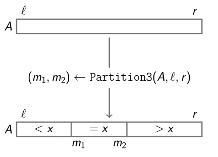
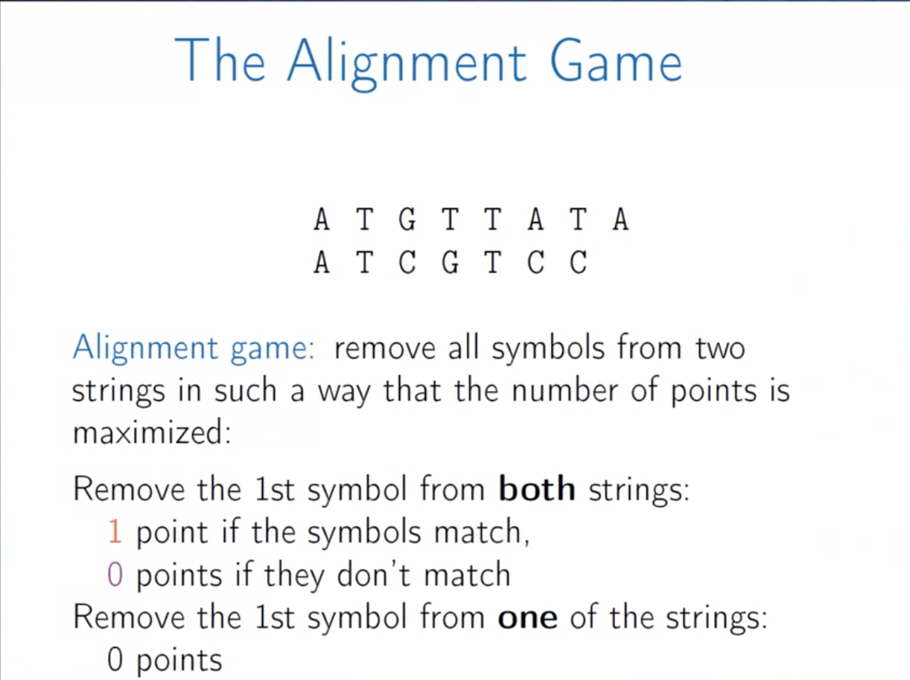

# Algorithm

# Greedy

[Code](./week3)

- **General Strategy**
  - Make a greedy choice
  - **Prove** that it is a **safe move**
  - Reduce to a **subproblem**
  - Solve the **subproblem**
  - Analyze runtime
- Reduction to Subproblem
  - Make some greedy choice
  - Reduce to a smaller problem
  - Iterate

- Safe move
  - A move is called safe if there is an optimal solution consistent with this first move
  - Not all first moves are safe
  - Often greedy moves are not safe

[Back to top](#Algorithm)

---

## Question

### Refuel car with least gas stations

- Safe move 选择最远能到达的gas station

### Group children 

Children in one group - age should not different more than one year

- Safe move 把孩子的年龄变成坐标点 从最左边点开始取一个长度为1的线段 依次找到需要几根线段

### Long hike Fractional Knapsack

可以分割的背包问题：背包中要装入零食 尽可能放入最多value的零食 可以切割零食 因此称为可以分割的背包问题

- Safe move 找到性价比(Value / Weight)最高的零食 优先放进去背包 

[Back to top](#Algorithm)

---

# Divide and Conquer

[Code](./week4)

- Create a recursive solution
- Define a corresponding recurrence relation T (写出递推表达式)
- Determine T(n) worst case runtime
- Optionally, create iterative solution

[Back to top](#Algorithm)

---

## Binary Search

O(LogN)

[Back to top](#Algorithm)

---

## Polynomial Mulyiplication

多项式乘法

Naive idea: Brutual force - O(n)

Better idea: 提出最高系数的一半 形成四个多项式 再进行运算 divide and conquer - 但是依旧是 O(n)


- Karatsuba approach


- Karatsuba approach example


[Back to top](#Algorithm)

---

## Master Theorem

- used to calc the runtime of **recurrence problems**

1. <font color=red>计算一下level 1 和 level 2 的运算量</font>
2. <font color=red>判断是否第一层和第二层的运算量是相同的，如果是那就是 **case 2**</font>
3. <font color=red>判断如果第一层的运算量大于第二层，那么第一层的复杂度就是dominate，所以符合 **case 1**</font>
4. <font color=red>判断如果第二层的运算量大于第一层，那么说明运算量是一层一层增加的，因此最后一层的复杂度dominate，所以符合 **case 3** logba 就是leaves 叶子的数量</font>


> 1. When I have a recurrence of this rough form, I look at the amount of work done at the first level and at the second level (which is a very easy calculation) and then I just say to myself Is that the same amount of work? 
>
> 
>
> 2. If it's the same amount of work it's going to be the same amount of work all the way down and so we're going to be in case two. So it's going to be the amount of work at the first level, which we known is O(n to the d), times log n because there are that many levels. 
>
> 
>
> 3. On the other hand, if the first term is larger than the second term I know the first term is going to dwarf all the other terms. And so, we're left with just O(n to the d). 
>
> 
>
> 4. And finally, if the first term is less than the second term, I know they're going to keep increasing and it's the bottom term that I need.

[Back to top](#Algorithm)

---

## Sorting Algos

> For any comparison based sorting algorithm. there exists an array A[1 ... n] such that the algorithm performs at least Ω(nlogn) comparision to sort A.

### Selection sort

Insertion sort, bubble sort, selection sort --- O(n<sup>2</sup>)

- Find a minimum by scanning the array
- Swap it with the first element
- Repeat with the remaining part of the array

>  O(n<sup>2</sup>)
>
> Sorts in place: requires a constant amount of memory

Insertion sort/bubble sort algorithm are O(n<sup>2</sup>) too.

[Back to top](#Algorithm)

---

### Merge sort

> O(nlogn)


```java
public class Sort {

    public static void MergeSort(int[] arr, int low, int high)
    {
        //使用递归的方式进行归并排序，所需要的空间复杂度是O（N+logN）
        int mid = (low + high)/2;
        if(low < high)
        {
            //递归地对左右两边进行排序
            MergeSort(arr, low, mid);
            MergeSort(arr, mid+1, high);
            //合并
            merge(arr, low, mid, high);
        }
    }
    
    //merge函数实际上是将两个有序数组合并成一个有序数组
    //因为数组有序，合并很简单，只要维护几个指针就可以了
    private static void merge(int[] arr, int low, int mid, int high)
    {
        //temp数组用于暂存合并的结果
        int[] temp = new int[high - low + 1];
        //左半边的指针
        int i = low;
        //右半边的指针
        int j = mid+1;
        //合并后数组的指针
        int k = 0;
        
        //将记录由小到大地放进temp数组
        for(; i <= mid && j <= high; k++)
        {
            if(arr[i] < arr[j])
                temp[k] = arr[i++];
            else
                temp[k] = arr[j++];
        }
        
        //接下来两个while循环是为了将剩余的（比另一边多出来的个数）放到temp数组中
        while(i <= mid)
            temp[k++] = arr[i++];
        
        while(j <= high)
            temp[k++] = arr[j++];
        
        //将temp数组中的元素写入到待排数组中
        for(int l = 0; l < temp.length; l++)
            arr[low + l] = temp[l];
    }
    
}
```

[Back to top](#Algorithm)

---

### Counting sort

> Non comparison sorting 
>
> Only for small integers 因为需要使用到额外的数组空间 如果排序的东西太大就不能实现了
>
> 并且只能是 integers 任何小数都不行因为无法表示 index

- Provided that all elements of A[1 ... n] are integers from 1 to M, CountSort(A) sorts A in time O(n+M).
- if M = O(n), then the running time is O(n).


[Back to top](#Algorithm)

---

### Quick sort

>Quick sort is a comparision based algorithm
>
>Running time: **O(nlogn)** on average, O(n<sup>2</sup>) in the worst case
>
>**Efficient in practice**


1. **How to pick Pivot for Quick sort** (随机选择pivot就是答案)

>Assume that all the elements of A[1 ... n] are pairwise different. Then the average running time of RandomizedQuickSort(A) is O(nlogn) while the worst case running time is O(n<sup>2</sup>).
>
>
>
>Averaging is over random numbers used the algorithm, but not over the inputs.

如果每一个选择的pivot都是平衡的 那么两个subarray长度相对平衡 整个递归树的层数大概是log层的 每一层都是O(n)的工作量 因此最终是**O(nlogn)**

如果每一个选择的pivot都是unbalanced的 那么两个subarray长度都非常的不平衡 整个递归树最大层数大概就是n层 并且每一层还是O(n)的工作量 因此最终的复杂度是 **O(n<sup>2</sup>)**

- **random pick pivot**

为了尽可能的选择让subarray balance 的pivot 我们完全随机的选择pivot 这样就能保证50%的机会找到balance subarray which is actually very **fast**


2. **How to deal with Equal elements in Quick sort** (three way partition is the answer)

试想如果一个array中的所有数字都相等 意味着这个array已经排序好了 然而quick sort每一次仍旧要选择一个pivot然后将剩下的元素全部分配到pivot的两侧 由于所有elements are euqal 所以会产生一侧是0个元素 另外一侧是n-1个元素的情况 这样就符合了我们之前讨论的关于unbalanced的subarray会出现的问题 也就是时间复杂度为**O(n<sup>2</sup>)**.

In order to解决这个问题 我们就引入了three way partition --- 即选出两个pivots and partition

```java
(m1, m2) <- Partition3(A, l, r);

such that
  for all l <= k <= m1 - 1, A[k] < x;
	for all m1 <= k <= m2, A[k] = x;
	for all m2 + 1 <= k <= r, A[k] > x;
```




3. **How to make sure QuickSort works in O(nlogn) time in the worst case**

- To eleminate **Tail Recursive Call**

<font color=red>用来确保additional space 是logN 相当于省去了一半的recursive call</font>


- Use **Intro Sort**
  - 每次选择pivot的时候拿出array的first last middle elements 比较 选择median作为pivot --- **不是总好用**
  - 另一种方法是每次recursive call记录递归的层数 一旦超过logN层 立刻切换到另外一种sorting algo --- **听着牛逼感觉也没啥用**


4. What is the amount of additional memory that regular Quick Sort uses (besides the array being sorted) in the worst case?

In the worst case, the array is always divided into a part of size 11 and a part with all the other elements, and the recursion depth in this case will be O(n). **<font color =red>Recursion needs O(1)additional memory for each call</font>**, so in the worst case Quick Sort will use O(n) additional memory. However, **<font color=red>by using tail recursion elimination we can make Quick Sort use no more than O*(log*n) additional memory</font>**.

```java
private static int partition2(int[] a, int l, int r) {
        int x = a[l];
        int j = l;
        for (int i = l + 1; i <= r; i++) {
            if (a[i] <= x) {
                j++;
                int t = a[i];
                a[i] = a[j];
                a[j] = t;
            }
        }
        int t = a[l];
        a[l] = a[j];
        a[j] = t;
        return j;
    }

    private static void randomizedQuickSort(int[] a, int l, int r) {
        if (l >= r) {
            return;
        }
        int k = random.nextInt(r - l + 1) + l;
        int t = a[l];
        a[l] = a[k];
        a[k] = t;
        //use partition3
        int m = partition2(a, l, r);
        randomizedQuickSort(a, l, m - 1);
        randomizedQuickSort(a, m + 1, r);
    }
```

[Back to top](#Algorithm)

---

# Dynamic Programming

[Code1](./week5)

[Code2](./week6)

## Change Problem

[Visualize link](https://www.cs.usfca.edu/~galles/visualization/DPChange.html)

Greedy 不一定总是OPT的 用DP可以一直找到最优解


## Alignment Game




