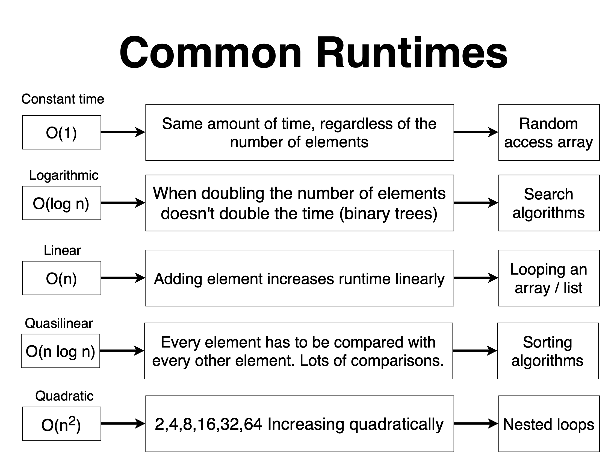
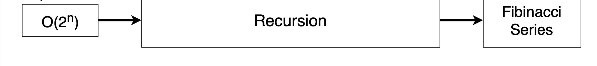
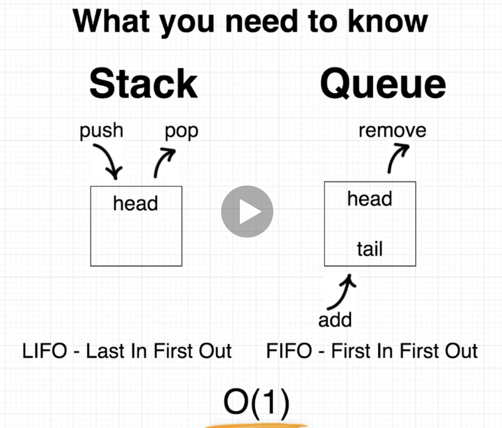
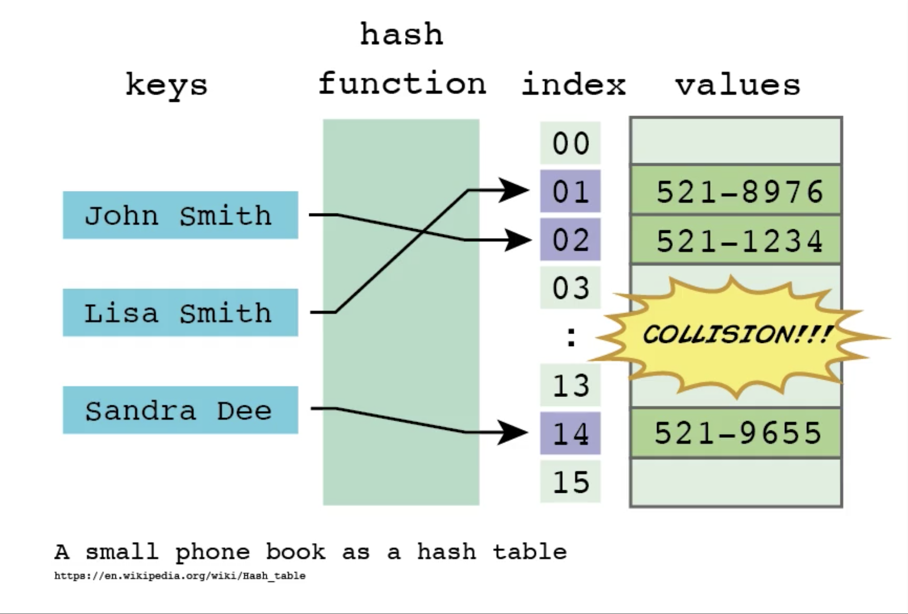

# Data Structure

## Array

### Array DS vs Array API

- Plain old array - Data Structure 静态数组

```java
int[] foo = new int[10];
```

- Collection built on top of an Array 动态数组

```java
ArrayList<Integer> bar = new ArrayList<Integer>();
```

| Data structures | APIS    | APIS            |
| --------------- | ------- | --------------- |
| Array           | used in | ArrayList       |
| Linked List     | used in | Stacks & Queues |
| Binary Tree     | used in | Binary Heap     |

[Back to top](#Data-Structure)

---

### Three things about Arrays

- Arrays can contain anything

```java
Object[] object = new Object[10];
String[] string = new String[10];
Person[] person = new Person[10];
```

- Fixed size 

Array cannot grow compared to LinkedList

- Random access

Array can be accessed throught index in O(1)

[Back to top](#Data-Structure)

---

### Array Killer features 

Get/Set/Random access in O(1) constant time

[Back to top](#Data-Structure)

---

### Insert into Array

- copy up and make room for the index
- insert the value into that space
- ```insert(1, "b")```O(n) Linear time

[Back to top](#Data-Structure)

---

### Delete in Array

- copy down to overwrite 
- O(n) Linear time

[Back to top](#Data-Structure)

---

### Dynamic Arrays

- Array's capacity is fixed
- 只能通过创建一个新的Array 来增加Array的space
- 创建新的Array会先double之前的Array的capacity 然后 copy旧的到新的里面
- 最后添加进去新的元素 （会浪费一些空间，因为一定会double之前的数组的空间）

[Back to top](#Data-Structure)

---

### Build my dynamicArray

[code](./algorithms101/src/main/java/datastructures/DynamicArray.java)

 ```java
package code;

public class DynamicArray<T> {
    private Object[] data;

    // counter the number of elements in our array
    private int size = 0;

    // The capacity of our array - or how many elements it can hold.
    // What we double when the number of elements exceeds the capacity of the array.
    private int initialCapacity;

    // 创建一个新的动态数组
    public DynamicArray(int initialCapacity) {
        this.initialCapacity = initialCapacity;
        data = new Object[initialCapacity];
    }

    // O(1)
    public String get(int index) {
        return (String) data[index];
    }

    // O(1)
    public void set(int index, String value) {
        data[index] = value;
    }

    // O(n)
    public void insert(int index, String value) {

        // check size
        if (size == initialCapacity) {
            resize();
        }
        // copy up
        for (int j = size; j > index; j--) {
            data[j] = data[j - 1];
        }

        // Insert
        data[index] = value;
        size++;
    }

    // O(n)
    public void delete(int index) {

        // copy down
        for (int i = index; i < size - 1; i++) {
            data[i] = data[i + 1];
        }

        // clear last element of array
        data[size - 1] = null;

        // size minus one
        size--;
    }

    public boolean isEmpty() {
        return size == 0;
    }

    // O(n)
    public boolean contains(String value) {
        for (int i = 0; i < size; i++) {
            String curVal = (String) data[i];
            if (curVal.equals(value)) {
                return true;
            }
        }
        return false;
    }

    public void print() {
        for (int i = 0; i < size; i++) {
            System.out.println(data[i]);
        }
    }

    public void add(String value) {
        if (size == initialCapacity)
            resize();

        data[size] = value;
        size++;
    }

    public void resize() {
        // 创建一个新的array
        Object[] newData = new Object[initialCapacity * 2];
        // 把旧的array copy到新的里面去
        for (int i = 0; i < initialCapacity; i++) {
            newData[i] = data[i];
        }
        // 将新创建的array覆盖旧的
        data = newData;
        // 更新array的capacity
        initialCapacity = initialCapacity * 2;
    }

    public int size() {
        return size;
    }

}
 ```

[Back to top](#Data-Structure)

---

### Error handling

[E.G.](https://www.runoob.com/java/java-exceptions.html)

```java
public void set(int index, String value) {
  if (index < initialCapacity) {
    data[index] = value;
  } else {
    throw new IndexOutofBoundsException("Index is too big.")
  }
}
```

[Back to top](#Data-Structure)

---

### Interview Array

- get/set - O(1) 
- insert - O(n) 
- Delete - O(n)
- Random access - 使用index访问任何元素都巨快
- Fixed capacity - 数组大小一旦声明就是定好的不能改变
- Double when resize - 当要向动态数组中插入元素时 一旦数组不够大 就会double space 

[Back to top](#Data-Structure)

---

## Linked List

### Linked List vs Array

- Linked List
  - Good:
    - No indexes
    - No fixed capacity
    - super fast insert/delete O(1) - constant time
    - can grow incrementally
  - Bad:
    - No random access
    - Get/set is O(n) - linear time
  - Commonly used in Stacks and Queues
- Array
  - [See the previous section](#Array)

[Back to top](#Data-Structure)

---

### Add Front

- 首先创建一个 new node
- 把 new node 的 pointer 指向 current head node
- 把 current head node 的 pointer 指向 new node

[Back to top](#Data-Structure)

---

### getFirst

- ```return head.data```

[Back to top](#Data-Structure)

---

### getLast

- 判断是否```head == null```
- find LinkedList tail
- 返回尾部的data

[Back to top](#Data-Structure)

---

### addBack

- 创建一个新Node
- 判断 head 是不是空 如果是 直接添加在头部
- 找到尾部
- 链表尾的next 指向newNode

[Back to top](#Data-Structure)

---

### size

- Solution one:
  - 在 LinkedList class 中, 预设一个```private int size```
  - 在 add 方法中添加一个 size ++
- Brutal force
  - check ```if head == null```
  - set counter to 1
  - find tail in while loop, each loop counter ++

[Back to top](#Data-Structure)

---

### clear

- 由于 LinkedList 是 Node 相连接一起的 
- 直接把 ``` head = null ``` Done!

[Back to top](#Data-Structure)

---

### Delete value

- 判断 head 如果空 直接return
- 如果头就是要删除的 直接``` head = head.next ```
- 如果在 middle 
  - 从头找到尾``` current.next != null; current = current.next; ```
  - 当 ```current.next.data == data; ``` 就 ``` current.next = current.next.next; ```

[Back to top](#Data-Structure)

---

### print

- while loop 从头到尾 
- 每一步 print

[Back to top](#Data-Structure)

---

### Double Linked List

[code](https://blog.csdn.net/javazejian/article/details/53047590)

- 每个节点 有存储他的 上一个 和 下一个 
- 机制和单向链表相同 

[Back to top](#Data-Structure)

---

### Build my LinkedList

[code](./algorithms101/src/main/java/datastructures/LinkedList.java)

```java
package code;

public class LinkedList {

    public class Node {
        int data;
        Node next;

        public Node(int data) {
            this.data = data;
        }
    }

    private Node head;

    // O(1)
    public void addFront(int data) {

        // Create new Node
        Node newNode = new Node(data);

        // if head ...
        if (head == null) {
            head = newNode;
            return;
        }

        // Set its next to the current head
        newNode.next = head;

        // Set current head be the new head
        head = newNode;
    }

    // O(1)
    public int gerFirst() {
        return head.data;
    }

    // O(n)
    public int getLast() {
        if (head == null) {
            throw new IllegalStateException("Empty List!");
        }
        Node current = head;

        // Find tail
        while (current.next != null) {
            current = current.next;
        }

        // When tail
        return current.data;
    }

    // O(n)
    public void addBack(int data) {
        Node newNode = new Node(data);

        // if no head ... set tail
        if (head == null) {
            head = newNode;
            return;
        }

        // Find tail
        Node current = head;

        while (current.next != null) {
            current = current.next;
        }

        // set tail' next to newNode
        current.next = newNode;
    }

    // O(n)
    public int size() {
        if (head == null) {
            return 0;
        }

        int count = 1;
        Node current = head;

        while (current.next != null) {
            current = current.next;
            count++;
        }

        return count;
    }

    // O(1)
    public void clear() {
        head = null;
    }

    // O(n)
    public void deleteValue(int data) {

        // if head ...
        if (head == null)
            return;

        if (head.data == data) {
            head = head.next;
        }

        // else we walk through
        Node current = head;

        while (current.next != null) {
            if (current.next.data == data) {
                current.next = current.next.next;
                return;
            }
            current = current.next;
        }
    }

    public void print() {
        Node current = head;
        while (current.next != null) {
            System.out.println(current.data);
            current = current.next;
        }
    }

}
```

[Back to top](#Data-Structure)

---

### Interview LinkedList

- Add Front - O(1)
- Add Back or middle - O(n)
- Delete - O(n)
- No random access
- No fixed capacity
- Always the right size

[Back to top](#Data-Structure)

---

### Array vs ArrayList vs Linked List

#### Differences

- Array - basic data structure
  - ```int[] numbers = new int[5]; ```
  - plain old data structure
  - fixed size/ can't grow
  - fast random access O(1)
- ArrayList - DynamicArray, Collection API 
  - ``` ArrayList<Integer> mums = new ArrayList<Integer>();```
  - Collection API built on top of Array
  - new APIs: insert, remove. isEmpty
  - Handles resizing
  - aka DynamicArray
- LinkedList - data structure
  - plain old data structure
  - no random access
  - Fast add front - O(1)
  - 需要自己实现很多添加删除操作

[Back to top](#Data-Structure)

---

#### When to use

Any data structure can be built with Array and LinkedList

- Arrays - lower level Data Structure
- ArrayList - high level APIs
- LinkedList - lower level Data Structure 多用于实现 栈和 队列
- Stacks/Queues - high level APIs

[Back to top](#Data-Structure)

---

## Big O Notation

[Common runtimes](./files/Common-Runtimes.pdf)






[Back to top](#Data-Structure)

---

### Rule of thumb

- Drop the non-donminant terms - O(n^2 + n) -> O(n^2)
- Drop the constants - O(3n) -> O(n)
- Add runtimes - 假如有两个for loop (两个不同数组 n 和 m) -O (n + m)
- Multiply runtimes - 假如两个for loop nested (两个不同数组  n 和 m) - O (n * m)

[Back to top](#Data-Structure)

---

### Practices

```java
package algorithms;

public class BigO {

		// O(n)
    public void foo(int[] array) {

        for (int i = 0; i < array.length; i++) {
            // ...
        }

        for (int i = 0; i < array.length; i++) {
            // ...
        }

    }
		
  // O(n * m)
    public void bar(int[] array1, int[] array2) {

        for (int i = 0; i < array1.length; i++) {
            // ...
            for (int j = 0; j < array2.length; j++) {
                // ...
            }
        }

    }

		// O(n^2)
    public void baz(int[] array) {

        for (int i = 0; i < array.length; i++) {
            // ...
            for (int j = 0; j < array.length; j++) {
                // ...
                if (array[i] < array[j]) {
                    // Launch!
                }
            }
        }

    }
	
  	// O(n^2)
    public void beep(int[] array) {

        for (int i = 0; i < array.length; i++) {
            // ...
            for (int j = 0; j < array.length; j++) {
                // ...
                for (int k = 0; k < 9999999; k++) {
                    // Jump!
                  	// O(1)
                }
            }
        }

    }

}
```

[Back to top](#Data-Structure)

---

### Two examples

- O(n + m) where m < n/2 => O(n)
- O(n + m) Not equal to O(n) 在不知道更多的关于m的情况下 不能再简化了

[Back to top](#Data-Structure)

---

### Interview Big O Notation

- Determine the runtime of an algorithm
- Looping through two **different** collections **separate** loops -> O (n + m)
- Looping through two **different** collections nested -> O (n * m)
- Looping through 1/2 a collection -> O (n)

[Back to top](#Data-Structure)

---

## Stacks and Queues

- Stacks
  - LIFO - last in first out
  - Peek, isEmpty 
  - push, pop - O(1)
- Queues
  - FIFO - first in first out
  - peek, isEmpty 
  - add, remove - O(1)

[Back to top](#Data-Structure)

---

### Push to Stack

- aka Add Front
- 使用链表
- O (1)

[Back to top](#Data-Structure)

---

### Pop from Stack

- 链表头读取 并删除节点
- O (1)

[Back to top](#Data-Structure)

---

### Add to Queue

- 使用 LinkedList
- 首先创建一个新的node
- 将tail.next 指向新的node
- 最后把newNode设置为tail
- O (1)

[Back to top](#Data-Structure)

---

### Remove from Queue

- 跟 pop from stack 非常相似
- O (1)

[Back to top](#Data-Structure)

---

### Runtime

- insert/delete from head or tail -> O(1)
- drop anything in the middle of Stack/Queue -> O(n)
- Access/search into the Stack/Queue -> O(n)

[Back to top](#Data-Structure)

---

### Build my Stack

[code](./algorithms101/src/main/java/datastructures/Stack.java)

```java
package code;

import java.util.EmptyStackException;

public class Stack {

    // 使用链表作为基础数据结构实现

    private class Node {
        private int data;
        private Node next;

        private Node(int data) {
            this.data = data;
        }
    }

    private Node head;
    private int size;

    public boolean isEmpty() {
        return head == null;
    }

    public int peek() {
        return head.data;
    }

    public void push(int data) {

        // check head
        if (head == null) {
            head.data = data;
        }

        // if head not null
        // create new node
        Node newNode = new Node(data);

        // new node next 指向 current head
        newNode.next = head;

        // 把new node 设为头
        head = newNode;

        // size 加一
        size++;
    }

    public int pop() {

        // check head
        if (head == null) {
            // throw new IllegalStateException("Empty stack!");
            throw new EmptyStackException();
        }

        // store data
        int data = head.data;

        // point head to next
        head = head.next;

        // size minus one
        size--;

        return data;
    }

    public int size() {
        return size;
    }
}

```

[Back to top](#Data-Structure)

---

### Build my Queue

[code](./algorithms101/src/main/java/datastructures/Queue.java)

```java
package code;

public class Queue {
    private class Node {
        private int data;
        private Node next;

        private Node(int date) {
            this.data = data;
        }
    }

    private Node head; // remove things
    private Node tail; // add things

    public boolean isEmpty() {
        return head == null;
    }

    public int peek() {
        return head.data;
    }

    public void add(int data) {

        // create a new node
        // set tail.next = newNode
        // set new node to tail

        Node newNode = new Node(data);
        if (tail != null) {
            tail.next = newNode;
        }
        tail = newNode;

        // the case if you add the first element in the queue
        // 需要明确的记住这里头就是尾巴 因为只有一个元素在队列中
        if (head == null) {
            head = tail;
        }
    }

    public int remove() {

        // save the data
        // point head to the next
        // return data

        int data = head.data;
        head = head.next;

        // Queue being empty
        if (head == null) {
            tail = null;
        }

        return data;
    }
}

```

[Back to top](#Data-Structure)

---

### Interview Stack and Queue



---

[Back to top](#Data-Structure)

## Hash Table

An Array consists LinkedLists



- hash function
- convert hash into index
- handle collision

[Back to top](#Data-Structure)

---

### Hash funtion

Calculated to numbers which can be used for lookup

- the algorithm should be Fast
- Gave even distributed numbers
- Minimizes collisions

[Back to top](#Data-Structure)

---

### Convert hash into index

- Take hash can do % operator to convert hash into much smaller size index

- ```int index = hashCode % INITIAL_SIZE;```
- 通过求余数 来生成 index

[Back to top](#Data-Structure)

---

### Handle collision

- 当两个Obj 有同一个index的时候
- 我们把这两个重复的 Objs 存入一个 LinkedList中 
- Called **Chaining**

[Back to top](#Data-Structure)

---

### Runtime

- Search, insert, delete - O(1) - good hash table 
- O(n) - bad hash table - which means you have a lot of collision - 可以导致变成O(n)

[Back to top](#Data-Structure)

---

### Build my HashTable

[code](./algorithms101/src/main/java/datastructures/HashTable.java)

```java
package code;

import javax.swing.text.html.parser.Entity;

public class HashTable {

    // 哈希表就是一个数组 里面都是链表
    private int INITIAL_SIZE = 16;
    private HashEntry[] data; // LinkedList

    class HashEntry {
        String key;
        String value;
        HashEntry next;

        HashEntry(String key, String value) {
            this.key = key;
            this.value = value;
            this.next = null;
        }
    }

    HashTable() {
        data = new HashEntry[INITIAL_SIZE];
    }

    public void put(String key, String value) {

        // Get the index
        int index = getIndex(key);

        // Create the linked list entry
        HashEntry entry = new HashEntry(key, value);

        // if no colision
        if (data[index] == null) {
            data[index] = entry;
        } else {
            // handle collision by adding to the end of Linked List
            HashEntry entries = data[index];

            // walk to the end
            while (entries.next != null) {
                entries = entries.next;
            }
            // add new entry
            entries.next = entry;
        }
    }

    public String get(String key) {

        // get index
        int index = getIndex(key);

        // Get the current list of entries
        HashEntry entries = data[index];

        // 从链表中开始寻找对应的key
        while (entries != null) {
            if (entries.key.equals(key)) {
                return entries.value;
            }
            entries = entries.next;
        }
        return null;
    }

    private int getIndex(String key) {
        // get hashcode
        int hashCode = key.hashCode();
        System.out.println(hashCode);

        // convert into index
        int index = (hashCode & 0x7fffffff) & INITIAL_SIZE; // bitwise to make sure the index are all positive
        // int index = hashCode & INITIAL_SIZE;

        return index;
    }
}

```

[Back to top](#Data-Structure)

---

### Interview HashTable

- Super fast lookup - O(1)
- Understand what hashing algorithm does
- Collisions are handled via **chaining**
- Index (not hash) used only for lookups

[Back to top](#Data-Structure)

---

## Binary Tree

- **full** binary tree - 每一个子节点都有两个孩子 or 零个孩子 - 不出现单一节点
- **perfect** binary tree - 每一个节点都有左孩子 和 右孩子
- **balanced** binary tree - 拥有尽可能最小height的树

- Breadth first - 广度优先
- Depth first - 深度优先

[Back to top](#Data-Structure)

---

### Binary Search Tree (BST)

- left child < parent < right child
- O(logN)
- Recursive
- We always work with the key for search

[Back to top](#Data-Structure)

---

### Find

- 标准二叉搜索

[Back to top](#Data-Structure)

---

### insert

- 从root开始 如果空 就放这
- 不空就二叉搜索 小左大右
- 找到一个空的 放这里

[Back to top](#Data-Structure)

---

### find min

- 生成node类中添加一个函数
- 递归左边 找到最左边最下面的node

[Back to top](#Data-Structure)

---

### delete

- no child
  - 直接 set it to null
- one child
  - 找到要delete的node
  - 找到他的child
  - 用child替换这个node 
- two children
  - 找到要delete的node
  - 找这个node整个右边最小的node / 或者找到左边最大的
  - 把右边最小node 复制到要删除的node上
  - 删除右边的重复的最小的node set to null
  - **Why can't we just set minRight = null?**
    - 删除最右边的最小 不能简单的直接set 为 null
    - 有可能他还有子树 所以要递归调用删除 让这个子树解决自己的问题
    - [link](http://www.mathcs.emory.edu/~cheung/Courses/171/Syllabus/9-BinTree/BST-delete2.html)

[Back to top](#Data-Structure)

---

### Depth First Traversal

- Inorder - left -> root -> right
- Preorder - root -> left -> right
- Postorder - left -> right -> root

[Back to top](#Data-Structure)

---

### Build my Binary Search Tree

[code](./algorithms101/src/main/java/algorithms/BinarySearchTree.java)

```java
package code;

public class BinarySearchTree {

    // Node
    class Node {
        int key;
        String value;
        Node right, left;

        public Node(int key, String value) {
            this.key = key;
            this.value = value;
        }

        public Node min() {
            if (left == null) {
                return this;
            } else {
                return left.min();
            }
        }
    }

    Node root;

    public BinarySearchTree() {
        root = null;
    }

    // Find
    public String find(int key) {

        Node node = find(root, key);

        return node == null ? null : node.value;
    }

    private Node find(Node node, int key) {
        if (node == null || node.key == key) {
            return node;
        } else if (key < node.key) {
            return find(node.left, key);
        } else if (key > node.key) {
            return find(node.right, key);
        }
        return null;
    }

    // Insert
    public void insert(int key, String value) {
        root = insertItem(root, key, value);
    }

    public Node insertItem(Node node, int key, String value) {

        // if null - set it here
        if (node == null) {
            node = new Node(key, value);
            return node;
        }

        // if not, find a null and set
        if (key < node.key) {
            node.left = insertItem(node.left, key, value);
        } else if (key > node.key) {
            node.right = insertItem(node.right, key, value);
        }
        return node;
    }

    public int findMinKey() {
        return findMin(root).key;
    }

    public Node findMin(Node node) {
        return node.min();
    }

    public void delete(int key) {
        root = delete(root, key);
    }

    public Node delete(Node node, int key) {
        if (node == null) {
            return null;
        } else if (key < node.key) {
            node.left = delete(node.left, key);
        } else if (key > node.key) {
            node.right = delete(node.right, key);
        } else {

            // case 1 : no child
            if (node.left == null && node.right == null) {
                node = null;
            }

            // case 2 : one child 
            else if (node.left == null) {
                node = node.right;
            } else if (node.right == null) {
                node = node.left;
            }

            // case 3 : two child
            else {
                Node minRight = findMin(node.right);

                node.key = minRight.key;
                node.value = minRight.value;

                node.right = delete(node.right, node.key);
            }
        }
        return node;
    }

    public void inOrderTraversal(Node node) {
        if (node != null) {
            inOrderTraversal(node.left);
            System.out.println(node.key);
            inOrderTraversal(node.right);
        }
    }

    public void preOrderTraversal(Node node) {
        if (node != null) {
            System.out.println(node.key);
            preOrderTraversal(node.left);
            preOrderTraversal(node.right);
        }
    }

    public void postOrderTraversal(Node node) {
        if (node != null) {
            postOrderTraversal(node.left);
            postOrderTraversal(node.right);
            System.out.println(node.key);
        }
    }
}

```

[Back to top](#Data-Structure)

---

### Runtime

- O(logN) - find/insert/delete

[Back to top](#Data-Structure)

---

### Interview Binary Search Tree

- Ordered
- Recurisive
- Full/Perfect/Balanced
- Depth(Inorder/PreOrder/PostOrder)/Breadth
- O(logN)

[Back to top](#Data-Structure)

---

## Binary Heaps

### properities

- 可以是最大堆/最小堆 （以最大堆为例）
- 堆顶端一定是最大的element
- 堆里可以有重复元素 duplicate ok
- Heap priority 堆顶 一定比下面大 = parent node 一定大于 两个孩子
- 但是两个孩子 不一定要左边比右边小 随意顺序

[Back to top](#Data-Structure)

---

### Binary Heap implementation


[Back to top](#Data-Structure)

---

### Insert

- Add to the bottom
- Heapify up
  - 如果这个element比他的parent大，就和parent交换位置
  - 如果这个element比parent小，stay where you are 

[Back to top](#Data-Structure)

---

### Extract the max

- 取出最大值 
- Swap top and bottom
- Heapify down
  - 最上面现在是最小值
  - 用parent和两个孩子比较
  - 把这个node和两个孩子中**较大**的一个交换位置
- Binary heap 中 不同 branch 里面的节点 不一定要满足 更高level的一定比低level的节点优先级高 - 在跨branches时候没有这一个规定

[Back to top](#Data-Structure)

---

###  Space efficiency

- Fast - ExtractMax - O(1)
- Compact, in-place swap 不占用额外很多空间
- 代码量短

[Back to top](#Data-Structure)

---

### Build my Binary Heap

[code](./algorithms101/src/main/java/algorithms/MaxIntHeap.java)

```java
package code;

import java.util.Arrays;

public class MaxBinaryHeap {
    private int capacity = 10; // 数组大小
    private int size = 0; // 元素个数

    public int[] items = new int[capacity];

    private int leftChildIndex(int parentIndex) {
        return 2 * parentIndex + 1;
    }

    private int rightChildIndex(int parentIndex) {
        return 2 * parentIndex + 2;
    }

    private int parentIndex(int childIndex) {
        return (childIndex - 1) / 2;
    }

    private boolean hasLeftChild(int index) {
        return leftChildIndex(index) < size;
    }

    private boolean hasRightChild(int index) {
        return rightChildIndex(index) < size;
    }

    private boolean hasParent(int index) {
        return parentIndex(index) >= 0;
    }

    private int leftChild(int index) {
        return items[leftChildIndex(index)];
    }

    private int rightChild(int index) {
        return items[rightChildIndex(index)];
    }

    private int parent(int index) {
        return items[parentIndex(index)];
    }

    public int extractMax() {
        if (size == 0)
            throw new IllegalStateException();
        int item = items[0]; // grab the max
        items[0] = items[size - 1]; // swap with the last
        size--; // delete laset entry (max)
        heapifyDown(); // reorder
        return item; // return
    }

    public void ensureCapacity() {
        if (size == capacity) {
            items = Arrays.copyOf(items, capacity * 2);
            capacity *= 2;
        }
    }

    public void insert(int item) {
        ensureCapacity();
        items[size] = item; // put in the last
        size++;
        heapifyUp();
    }

    public void heapifyUp() {
        int index = size - 1; // start at last element
        // while my parents are less than me...

        while (hasParent(index) && parent(index) < items[index]) {
            swap(parentIndex(index), index);
            index = parentIndex(index); // walk upwards to next node
        }
    }

    public void heapifyDown() {
        int index = 0; // start from the top

        while (hasLeftChild(index)) {

            // take the larger of the two indexes
            int largerChildIndex = leftChildIndex(index);
            if (hasRightChild(index) && rightChild(index) > leftChild(index)) {
                largerChildIndex = rightChildIndex(index);
            }

            // now compare

            // if I am larger than the items of my two children...
            // then everything is good. I am sorted.
            if (items[index] > items[largerChildIndex]) {
                break;
            } else {
                // we are still not in order - swap
                swap(index, largerChildIndex);
            }

            // then move down to smaller child
            index = largerChildIndex;
        }
    }

    public void print() {
        for (int i = 0; i < size; i++) {
            System.out.println(i + "[" + items[i] + "]");
        }
    }

    private void swap(int indexOne, int indexTwo) {
        int temp = items[indexOne];
        items[indexOne] = items[indexTwo];
        items[indexTwo] = temp;
    }
}

```

[Back to top](#Data-Structure)

---

### Runtime

- ExtractMax - O(1)
  - Peek() - O(1)
  - Heapify - O(logN)
- Heapify - O(logN) - single run
- Heap Sort - O(NlogN)
  - sorting the tree n times

[Back to top](#Data-Structure)

---

### Interview Binary Heap

- Peek - O(1) - Extract max or min in constant time
- Maintain Heap order
  - Insert - heapify up
  - Extract - heapify down
- Used for Priority Queue, scheduling, routing packets, and etc...

[Back to top](#Data-Structure)

---

## AVL Trees

