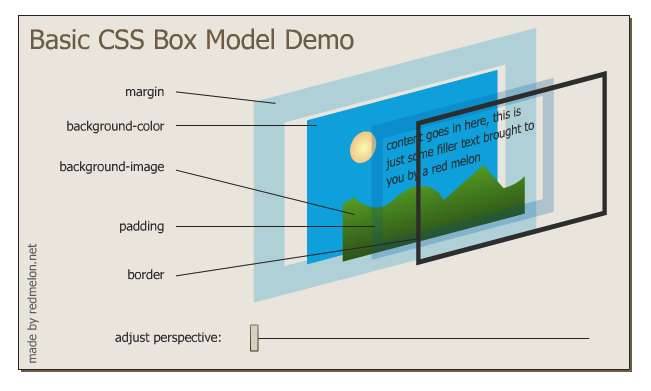
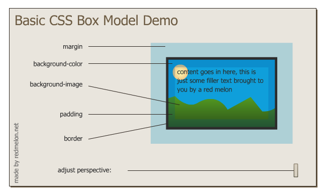

# HTML

doc: [link](https://devdocs.io/html/) 

- [HTML](#html)
  * [HTML tags](#html-tags)
  * [Comment](#comment)
  * [Boilerplate](#boilerplate)
  * [Basic elements](#basic-elements)
  * [HTML lists](#html-lists)
  * [HTML image element](#html-image-element)
  * [HTML Links and Anchor Tags](#html-links-and-anchor-tags)
  * [HTML Tables](#html-tables)
  * [HTML Forms](#html-forms)
- [CSS](#css)
  * [SCSS](#scss)
  * [Inline CSS](#inline-css)
  * [Internal CSS](#internal-css)
  * [External CSS](#external-css)
  * [Debug CSS](#debug-css)
  * [CSS Syntax](#css-syntax)
  * [CSS Selector](#css-selector)
  * [Class vs Ids](#class-vs-ids)
  * [Favicons](#favicons)
  * [HTML div](#html-div)
  * [Box Model of Website Styling](#box-model-of-website-styling)
  * [CSS Display Property](#css-display-property)
  * [CSS static and Relative Positioning](#css-static-and-relative-positioning)
  * [Centering Element](#centering-element)
  * [Font Styling](#font-styling)
  * [Adding Content](#adding-content)
  * [CSS sizing](#css-sizing)
  * [CSS Float and Clear](#css-float-and-clear)

---

## HTML tags

- opening/closing tags - `<h1></h1>`
- Self-closing tags - `<br> <hr>`

`<hr size="3">`

- `hr` is element
- `size="3"` is attribute

[Back to top](#HTML)

---

## Comment

`<!--     -->`

[Back to top](#HTML)

---

## Boilerplate

html5

```html
<!DOCTYPE html>
<html>
  <head>
    <meta charset="utf-8">
    <title></title>
  </head>
  <body>
    
  </body>
</html>
```

- title: website tab's name
- charset: utf-8 encoding
- meta: `<meta name="description" content="How to search this website">` - used for search engine

[Back to top](#HTML)

---

## Basic elements

- `<h1></h1>` - heading
- `<p></p>` - paragraph
- `<em></em>` - italic 斜体
- `<strong></strong>` - bold 加粗
- `<hr>` - 黑色分隔实线

[Back to top](#HTML)

---

## HTML lists

- un-ordered lists

```html
<ul>
  <li></li>
  <li></li>
</ul>
```

- ordered lists

```html
<ol>
  <li></li>
  <li></li>
</ol>

<ol type="i">
  
</ol>

<ol start="7">
  
</ol>
```

[Back to top](#HTML)

---

## HTML image element

``

- self-closing tag

- `img` - element
- `src="abc.png"` - attribute
- `alt` - 如果link不能用 会显示一个替代文本

[Back to top](#HTML)

---

## HTML Links and Anchor Tags

`<a herf="https://...">Hello</a>`

- `a` - Anchor - 用于超链接
- `herf` - attribute the link you want to use

[Back to top](#HTML)

---

## HTML Tables

```html
<table>
  <thead>
  	<tr>
    	<th>Dates</th>
      <th>Works</th>
    </tr>
  </thead>
  <tbody>
  	<tr>
      <td>2000-2001s</td>
      <td>coding</td>
  	</tr>
    <tr>
    	<td>2005-2008</td>
      <td>programming</td>
    </tr>
  </tbody>
  <tfoot>
  
  </tfoot>
  
</table>
```

- We can also use the table to structure the page. - E.G.: put `` in one `<td>` and `<p>` in the other `<td>`

[Back to top](#HTML)

---

## HTML Forms

- [form](https://developer.mozilla.org/en-US/docs/Web/HTML/Element/form) doc

- [input](https://developer.mozilla.org/en-US/docs/Web/HTML/Element/input) doc

```html
<form class="" action="index.html" method="post">
  <label>My name:</label>
  <input type="text" name="name" id="name" required>
  <input type="color" name="" id="">
  <input type="checkbox" name="" id="">
  <label>Password:</label>
  <input type="password" name="" id="">
  <input type="submit" name="">
</form>
```

- Contact me

```html
<form class="" action="mailto:yinhaoh@uci.edu" method="post">
  <label>Your name:</label>
  <input type="text" name="yourName" value=""><br>
  <label>Your email:</label>
  <input type="email" name="yourEmail" value=""><br>
  <label>Your message:</label>
  <textarea name="yourMessage" rows="10" cols="30"></textarea><br>
  <input type="submit" name="">
</form>
```

[Back to top](#HTML)

---

# CSS

doc: [link](https://developer.mozilla.org/en-US/docs/Web/CSS)

Colorhunt: [link](https://colorhunt.co/) - To find some beautiful colors

[Back to top](#HTML)

---

## SCSS

[link](https://www.ruanyifeng.com/blog/2012/06/sass.html)

[Back to top](#HTML)

---

## Inline CSS

```html
<body style="background-color: blue;">
  
</body>
```

[Back to top](#HTML)

---

## Internal CSS

```html
<style>
  
  body {
    background-color: blue;
  }
  
  hr {
    background-color: white;
    border-style: none;
    border-top-style: dotted;
    border-color: grey;
    border-width: 5px;
    height: 0px;
    width: 5%;
  }
  
</style>
```

[Back to top](#HTML)

---

## External CSS

index.html

```html
<head>
  <link rel="stylesheet" herf="css/styles.css">
</head>
```

styles.css

```css
<style>
  
  body {
    background-color: blue;
  }

  h1 {
		color: black;
  }

	h3 {
		color: black;
  }
  
  hr {
    background-color: white;
    border-style: none;
    border-top-style: dotted;
    border-color: grey;
    border-width: 5px;
    height: 0px;
    width: 5%;
  }
  
</style>
```

[Back to top](#HTML)

---

## Debug CSS

- Chrome developer tool -> Elements -> body -> Styles
- 可以使用 checkbox in the Styles 去一个一个尝试对应的style - 不会影响code

[Back to top](#HTML)

---

## CSS Syntax

[link](https://developer.mozilla.org/en-US/docs/Web/CSS/Reference) - find keywords

`selector{property: value;}`

- `selector` - hr
- `property` - background-color - 要按照字典顺序排序
- `value` - red

[Back to top](#HTML)

---

## CSS Selector

```html

```

```css
.bacon{
	background-color: green;
}
```

[Back to top](#HTML)

---

## Class vs Ids

Id:

```html
<h1 id="heading">I love you</h1>
```

```css
#heading {
  color: blue;
}
```

Class:

```html

```

```css
.bacon{
	background-color: green;
}

.circular{
  border-radius: 100%;
}
```

- Id - apply to only one element in entire html file
  - 尽可能不要使用id
- Class - apply same style to a group of elements
  - 一个element 可以应用多个class

pseudo-class: [link](https://developer.mozilla.org/en-US/docs/Learn/CSS/Building_blocks/Selectors/Pseudo-classes_and_pseudo-elements)

```css
img:hover {
  background-color: red;
}
```

[Back to top](#HTML)

---

## Favicons

- create [favicon](https://www.favicon.cc/)

- `<link rel="icon" herf="favicon.ico">`

[Back to top](#HTML)

---

## HTML div

- 一个逻辑区域块 相似的还有 `<span>`

- used for CSS

- `<div class=""></div>`

[Back to top](#HTML)

---

## Box Model of Website Styling

structure of a box: [link](https://markusvogl.com/web1/interactive_box_model/css_box_demo.html)

- Everything is a box.
- `{height: 60px; width: 100%;}` - div 的高 和 宽
- `{border:solid}` - div 是否有 border
- `{border-top:0px} {border-width: 0px 10px 20px 30px}` 顺时针div的上右下左 顺时针
- `{padding: 20px}` - 文字离border的距离
- `{margin: 10px}` - 每个box离其他box之间的距离 10px

```html
<div class="top">
  
</div>
<div class="mid">
  
</div>
<div class="bottom">
  
</div>
```

```css
.top{
  border: solid;
}
```





[Back to top](#HTML)

---

## CSS Display Property

- `block` element - `<p></p>` - 宽度占整个browser
- `inline` element - `<span class="pro"></span>` `` `<a>` - 只占自己该占的大小 - 不能改变width
- `inline-block` 有span的能力 还支持调整width 可以在同一行显示 - 不错哟
- `none` - 字面意思 - 直接变成看不见 消失了 也不占空间
  - `visibility: hidden;` - 也会消失不见，但是还占对应的空间，只是内容看不见- 类似于quiz show answer after answering

```css
/*
即使是<p>也可以变成inline 通过改变display
即使是<span>也可以变成block 通过改变display
*/

p {
  display: inline
}

span {
  display: block;
  background-color: black;
}
```

[Back to top](#HTML)

---

## CSS static and Relative Positioning

**Html 本身就有默认的css position be aware of that**

- `position: static;` - 使用默认html的css

- `position: relative;` - 可以根据之前的位置 找到相对位置

  - ```css
    img {
      position: relative
      left: 30px;
      top: 20px;
    }
    ```

  - 不会影响其他的element - aka如果这个div占了别的div的位置-会变成覆盖 而不会把别的div挤走

- `position: absolute;` - 根据这个element的parent 找到对应的位置

  - 会影响其他element- 如果这个div被设置绝对位置移走了，其他的div会直接补上
  - parent doesn't have to be `<body>`; it can be any relative `div`

- `position: fixed;` - 一旦选择了fixed即使滚动网页 上下滑动翻页 对应的div也会保持在原地不动

[Back to top](#HTML)

---

## Centering Element

[margin](https://developer.mozilla.org/en-US/docs/Web/CSS/margin) doc

```css
body {
  text-align: center;
}

/*h1 中有width的时候 要使用margin来设置居中*/
h1 {
  width: 10%;
  margin: 0 auto 0 auto;
}
```

[Back to top](#HTML)

---

## Font Styling

[doc](https://www.w3schools.com/css/css_font.asp)

- 可以定义多个字体，保证safe 如果用户没有安装第一个字体，那么可以顺位到第二个字体

```css
body {
  font-family: verdana, sans-serif;
}
/*
Meaning: browser 先按照verdana render 如果用户没有安装verdana 就默认使用 sans-serif
*/
```

- 如果我就非要用这个我定义的字体，可以去找然后添加到`index.html`里面
  - [link](https://fonts.google.com/) find Google font 

[Back to top](#HTML)

---

## Adding Content 

- Generate text: [link](https://loremipsum.io/)
- Find some flat icon: [link](https://www.flaticon.com/)
- Find gifs: [link](https://giphy.com/)
- Generate button: [link](https://css3buttongenerator.com/)

[Back to top](#HTML)

---

## CSS sizing

- static font size

```css
h1 {
  font-size: 90px;
}
```

- dynamic font size : `100% 对应 16px` - `90px 就对应 562.5%`

- `1em = 100% = 16px`

- `em`和`%` 都是可以继承的，如果在`body`中定义了`2em`然后再`h1`中定义`5em` font size会继承到`h1`里面 - 导致超级大

  - ```css
    h1 {
      font-size: 562.5%; 
    }
    ```

  - ```css
    h1 {
      font-size: 5.625em; 
    }
    ```

- **CSS3** 中 `2em` 变成了 **`2rem`** 解决了这个大小乱七八糟的问题

  - ```css
    h1{
      color: #66BFBF;
      font-size: 5.625rem;
      margin: 50px auto 0 auto;
      font-family: 'Sacramento', cursive;
    }
    ```

[Back to top](#HTML)

---

## CSS Float and Clear

**尽可能不要使用 尽量使用传统的positioning - Only use float when it is necessary** 

- `float: left;` - 把这个element float on the left 其他的文字就会 wrap around on the right
- `clear: left;` - 把这个element 的左边清空，保证没有文字或图片在这个element的左边

[Back to top](#HTML)

---

