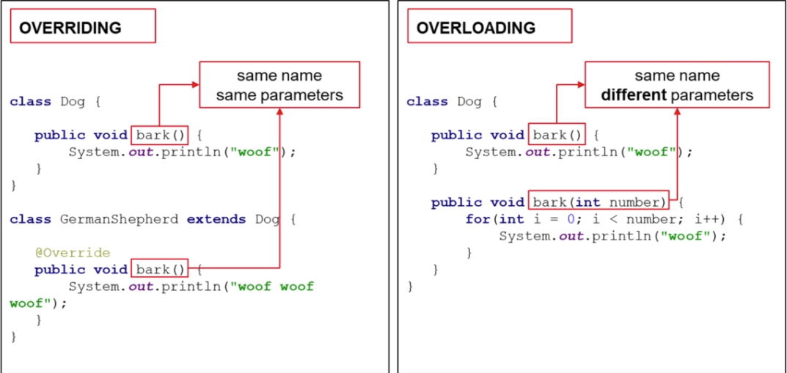
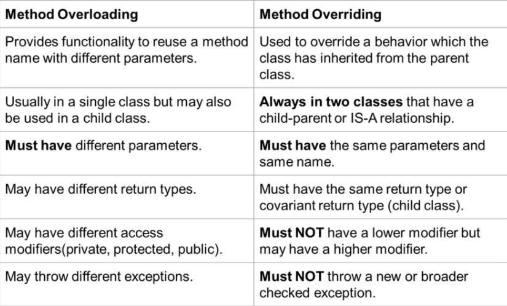

# Java

## Basics

### Main Method

- always static
- Keyword - main
- String[] args - 参数list

[Back to top](#Java)

---

### Primitive Types

#### Wrapper classes

- ```boolean, byte, char, short, int, long, float, double``` - 都是wrapper classes
- E.G. - ```int```, we use ```Integer```, and by doing that, it gives us ways to perform operations on an ```int```. -例如 ```Integer.MIN_VALUE, Integer.MAX_VALUE``` 

[Back to top](#Java)

---

#### Overflow and Underflow

- ```Integer.MIN_VALUE - 1``` 会变成 ```Integer.MAX_VALUE``` - underflow
- ```Integer.MAX_VALUE + 1``` 会变成 ```Integer.MIN_VALUE``` - overflow

[Back to top](#Java)

---

#### Width

- Byte - byte - 8 bits
- Short - short - 16 bits
- Integer - int - 32 bits
- Long - long - 64 bits - ``` long number = 100L; ```
- Float - float - single precision 单精度 - 32 bits - ``` float number = 5.25f; ```
- Double - double - double precision 双精度 - 64 bits - ``` double number = 5.25d; ```
- Character - char - 16 bits - 一个char只能存储一个字符
- Boolean - boolean - 8 bits

[Back to top](#Java)

---

#### Casting

- 强制类型转换

[Back to top](#Java)

---

### Java Package

- usually 使用公司域名 reverse 类似于路径
- com.google - ""项目目录" folder -> "com" folder-> "google" folder

[Back to top](#Java)

---

### String

- Immutable - every time modify a string, Java create a new one for us.

[Back to top](#Java)

---

#### Parse int from a string

```java
String numberASString = "2020";

int number = Integer.parseInt(numberASString);
double number = Double.parseDouble(numberASString);
```

[Back to top](#Java)

---

### Structures in Java

Not important, just FYI

- Operators - ```int a = b + c;``` - "+"
- Operands - ```int a = b + c;``` - "b and c"
- Expression - ```int a = b + c; ``` - ```a = b + c;``` 是expressions
- Statement - ```int a = b + c; ``` - 整句是statement
- Whitespace - 中间的空格 - 用来分隔
- Indentation - 代码缩紧 - 用来表示不同代码块 - easy to read
- Code Block - 两个大括号中间 - 表示一个代码块 - {} - if/else 负责一个代码块 - 一旦执行结束就会自动 delete 这个code block 中的变量

[Back to top](#Java)

---

### if And Or Not

- if()  等==  非等!=
- && 与
- || 或
- ! 非

[Back to top](#Java)

---

### Ternary Operator

- ```(a == b) ? A : B ```- （a == b） 就 A 否则 B

[Back to top](#Java)

---

### Abbreviating Operators

- ```i ++; ```
  - **Java 中 i++ 语句是需要一个临时变量取存储返回自增前的值，而 ++i 不需要**
  - 因此在 for 循环中尽量的使用 ++i 

- ```result += 2;```

[Back to top](#Java)

---

### Method

- Class 中的函数叫做 Method
- static method 可以在 main 函数中直接调用
- 如果不写 static 需要在 main 函数中先创建一个对象 再用对象.method 调用
- return -1; 通常用来表示 invalid. 

[Back to top](#Java)

---

#### Method Overloading

- same method name with different number of parameters
- Java 会根据不同参数调用不同 method
- only change the return type of method is not overloading - Error 

[Back to top](#Java)

---

### Control Flow Statements

#### switch

```java
int switchValue = 6;

switch(switchValue) {
    case 1:
        System.out.println("This is 1")
        break;
    case 2:

    case 3:

    default:
        blablabla..
        break;
}
```

[Back to top](#Java)

---

#### Loop List

```java
List<String> list = new ArrayList<String>();

// 方法1，Iterator迭代器遍历
Iterator<String> i = list.iterator();
while (i.hasNext()) {
  String s = i.next();
  System.out.println(s);
}

for(Iterator<String> iter = list.iterator(); iter.hasNext();) {
  System.out.println(iter.next());
}

//遍历Collection对象的传统方式
/* 建立一个Collection */
String[] strings = {"A"， "B"， "C"， "D"};
Collection stringList = java.util.Arrays.asList(strings);

/* 开始遍历 */
for (Iterator itr = stringList.iterator(); itr.hasNext();) {
	Object str = itr.next();
	System.out.println(str);
}

// 方法2，ListIterator迭代器遍历集合
ListIterator<String> lt = list.listIterator();
while (lt.hasNext()) {
  String ss = lt.next();
  System.out.println(ss);
}

// 方法3，普通for遍历集合
for (int x = 0; x < list.size(); x++) {
  String sss = list.get(x);
  System.out.println(sss);
}

// 方法4，增强for遍历集合
for (String ssss : list) {
  System.out.println(ssss);
}

```

[Back to top](#Java)

---

#### Loop set

```java
Set<String> set = new HashSet<String>();

// 方法1，Iterator迭代器遍历集合
Iterator<String> it = set.iterator();
while (it.hasNext()) {
  System.out.println(it.next());
}

// 方法2，增强for遍历集合
for (String s : set) {
  System.out.println(s);
}

```

[Back to top](#Java)

---

#### for-while-do while

- continue - 跳过这一次循环
- break - 跳出当前循环体 
- 利用 label continue 外层循环

```java
search: for (int i = 0; i < words.length - 1; ++i) {
            String word1 = words[i];
            String word2 = words[i + 1];

            for (int k = 0; k < Math.min(word1.length(), word2.length()); ++k) {
                if (word1.charAt(k) != word2.charAt(k)) {
                    if (index[word1.charAt(k) - 'a'] > index[word2.charAt(k) - 'a']) {
                        return false;
                    } else {
                        continue search;
                    }
                }
            }
            if (word1.length() > word2.length())
                return false;
        }
```

```java
while(count != 6) {
  	System.out.println("Count value is " + count);
  	count++;
}

for(int i=6; i!= 6; i++) {
  	System.out.println("Count value is " + count);
}

count = 6;
do {
    System.out.println("Count value was " + count);
    count++;

    if(count >100) {
      break;
    }

} while(count != 6);
```

[Back to top](#Java)

---

### Scanner Input

```java
import java.util.Scanner;

public class Main {
  
  	public static void main(String[] args) {
      	Scanner scanner = new Scanner(System.in);
      
      	System.out.println("Enter name: ");
      	String name = scanner.nextLine();
      	scanner.nextLine(); // handle next line character (enter key)
      
      	System.out.println("Enter your year of birth: ");
      	int yearOfBirth = scanner.nextInt();
      	
      	scanner.close(); // 最好关闭scanner 可以release memory
    }
}
```

[Back to top](#Java)

---

## OOP

### Class

- Do not allow user access the field directly
- Encapsulation
- Intellij allow user to quickly generate getter and setter
- 每一个 Class 都继承一个 Object Class - 类似于 JS 中的 window 或者 node 中的 Global

```java
public class Car {
  	
  	private int doors; // field/state components
  	private int wheels;
  	private String model;
  	private String engine;
  	private String color; 
  	
  	public void setModel(String model) {
      	this.model = model;
    }
  
  	public String getModel() {
      	return this.model;
    }
}
```

```java
public class Main {
  	public static void main(String[] args) {
      	Car porsche = new Car();
      	porsche.setModel("Carrera");
    }
}
```

[Back to top](#Java)

---

#### Concept in Class

- Reference - 引用 instance 的存储地址 - Node myNewNode = myNode; - 就是一个引用 - 改变其中一个，两个obj都会改变
- Object - 用 Class 创建的 一个 某某型的 对象
- Instance - 使用 new 创建的 Class 的实例
- Class - 一个 Class 类似建筑蓝图 某某某型的 Obj

[Back to top](#Java)

---

### Constructor in Class

[link](./Class_Constructor/Account.java)

- Default empty constructor is built by Java
- 默认构造函数
- 通常会定义一个非常全面的 用于赋值的 构造函数 - 当需要其他构造函数的时候 可以选择调用这个全面的构造函数

```java
public Account() {
        this("56789", 2.50, "Default name", "Default address", "default phone"); // 可以使用这种方式来直接设置默认值
        System.out.println("Empty constructor called");
    }
```

- ```this("56789", 2.50, "Default name", "Default address", "default phone");``` 这一行又 call 了一次 constructor 实现了默认赋值 

```java
public class Account {
    private String number;
    private double balance;
    private String customerName;
    private String customerEmailAddress;
    private String customerPhoneNumber;

    public Account() {
        this("56789", 2.50, "Default name", "Default address", "default phone"); // 可以使用这种方式来直接设置默认值 - it called another Constructor
        System.out.println("Empty constructor called");
    }

    public Account(String number, double balance, String customerName, String customerEmailAddress,
                   String customerPhoneNumber) {
        System.out.println("Account constructor with parameters called");
        this.number = number;
        this.balance = balance;
        this.customerName = customerName;
        this.customerEmailAddress = customerEmailAddress;
        this.customerPhoneNumber = customerPhoneNumber;
    }
}
```

[Back to top](#Java)

---

### Inheritance

- Use ```super``` 表示父亲类 - 被 extends 的 Class
- 儿子 Class 可以直接使用父亲 Class 里面的 method 
- 儿子 Class 里面可以 Override 父亲 Class 里面的 method
- 不写出 super 时候 优先 run 当前 Class 中的 method; 如果有super 就run 父亲Class里面的method

```java
public class Dog extends Animal {

    private int eyes;
    private int legs;
    private int tail;
    private int teeth;
    private String coat;

    public Dog(String name, int size, int weight, int eyes, int legs, int tail, int teeth, String coat) {
        super(name, 1, 1, size, weight);
        this.eyes = eyes;
        this.legs = legs;
        this.tail = tail;
        this.teeth = teeth;
        this.coat = coat;
    }

    private void chew() {
        System.out.println("Dog.chew() called");
    }

    @Override
    public void eat() {
        System.out.println("Dog.eat() called");
        chew();
        super.eat();
    }
}
```

[Back to top](#Java)

---

### this vs super

- super - parent class - commonly used in overwrite
- super() - Java 会默认call - 调用父亲构造函数 - 必须是代码块中的**第一句**
- An abstract class 抽象类 也是一个 super 类
- this - 当前 class
- this() - call 当前class 构造函数

this()

.png)

super()

.png)

[Back to top](#Java)

---

### Method Overloading vs Overriding

- Overload: 
  - 同一个method name 有不同的参数
  - 通常在同一个类内
  - 可以 overload static method
- Overriding:
  - 同一个name 同样参数
  - 继承中 孩子类中 重写一个父亲类中的 method
  - 不能overide static methods, Constructors, private methods or **find**





[Back to top](#Java)

---

### Static methods vs instance methods

如果一个method不使用任何 fields(instances or variables) or instance methods，就使用static

大多数时候还是用instance methods

- static:
  - 不能直接访问 instance methods
  - 不能使用 this
  - 如果一个method 不使用任何 instance里面的数据，应该被定义为静态
  - 不需要创建一个instance去调用static method
- instance: 
  - 需要创建instance去调用方法
  - 可以直接访问 instance methods
  - 可以直接访问 static methods

[Back to top](#Java)

---

### Static variables vs instance variables

- static variables:
  - 所有instance都能看见或使用这个static variable - 并且是同一个变量
  - 改变这个静态变量 - 会影响所有使用这个变量的instance/objs
- Instance variables:
  - a.k.a fields or member variables
  - belong to an instance of class
  - 每个 instance 有自己的 copy of instance 变量

[Back to top](#Java)

---

### Composition

[link](./Composition/Main.java) - folder

- **尽可能使用 Composition 不要 继承**
- 组成 - Has A 关系
- 在当前A类中 拥有一个B类
- **Create obj within obj**

```java
public class A {
  	private B b;
  	private int id;
} 
```

```java
public class Main {

    public static void main(String[] args) {
	    Dimensions dimensions = new Dimensions(20, 20, 5);
        Case theCase = new Case("2208", "Dell", "240", dimensions);

        Monitor theMonitor = new Monitor("27inch Beast", "Acer", 27, new Resolution(2540, 1440));

        Motherboard theMotherboard = new Motherboard("BJ-200", "Asus", 4, 6, "v2.44");

        PC thePC = new PC(theCase, theMonitor, theMotherboard);
        thePC.getMonitor().drawPixelAt(1500, 1200, "red" );
        thePC.getMotherboard().loadProgram("Windows 1.0");
        thePC.getTheCase().pressPowerButton();
    }
}
 
```

[Back to top](#Java)

---

## HashMap

### merge

- [Java HashMap merge() 方法](https://www.runoob.com/java/java-hashmap-merge.html)

merge() 方法会先判断指定的 key 是否存在，如果不存在，则添加键值对到 hashMap 中。

merge() 方法的语法为：

```java
hashmap.merge(key, value, remappingFunction)
```

**参数说明：**

- key - 键
- value - 值
- remappingFunction - 重新映射函数，用于重新计算值

如果 key 对应的 value 不存在，则返回该 value 值，如果存在，则返回通过 remappingFunction 重新计算后的值。

E.G.

```java
import java.util.HashMap;

class Main {
    public static void main(String[] args) {
        // 创建一个 HashMap
        HashMap<String, String> countries = new HashMap<>();

        // 往HashMap插入映射项
        countries.put("Washington", "America");
        countries.put("Canberra", "Australia");
        countries.put("Madrid", "Spain");
        System.out.println("HashMap: " + countries);

        //合并 key为 Washington的映射
        String returnedValue = countries.merge("Washington", "USA", (oldValue, newValue) -> oldValue + "/" + newValue);
        System.out.println("Washington: " + returnedValue);

        //输出更新后的HashMap
        System.out.println("Updated HashMap: " + countries);
    }
}
```

输出结果：

```java
HashMap: {Madrid=Spain, Canberra=Australia, Washington=America}
Washington: America/USA
Updated HashMap: {Madrid=Spain, Canberra=Australia, Washington=America/USA},  
```

[Back to top](#Java)

---

