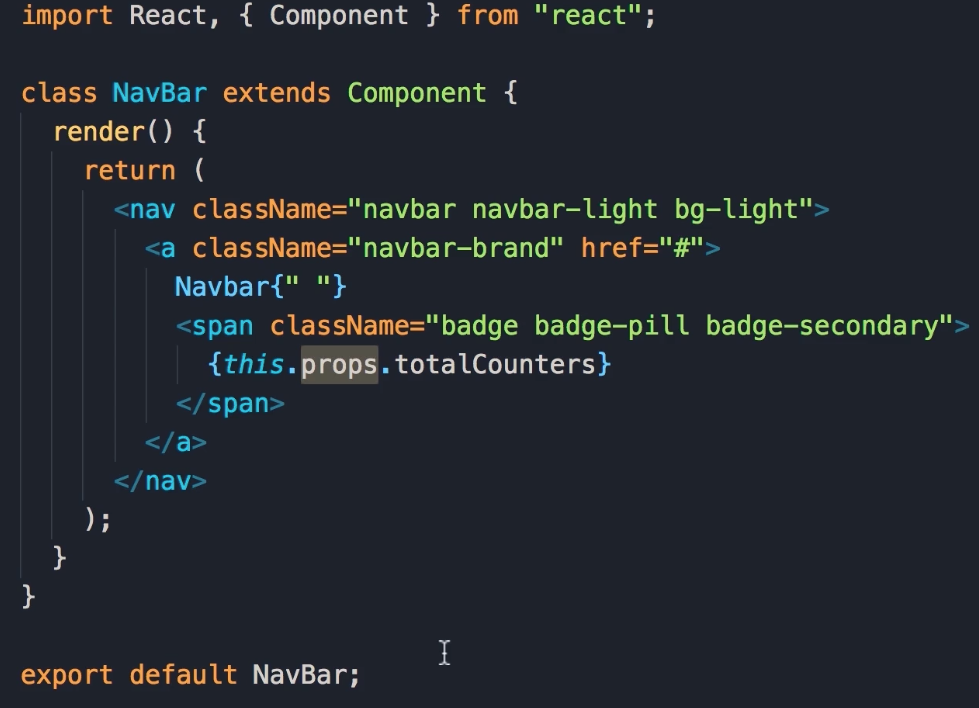
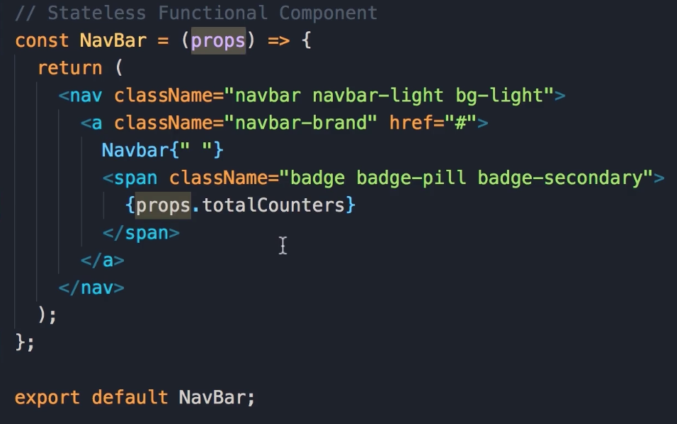
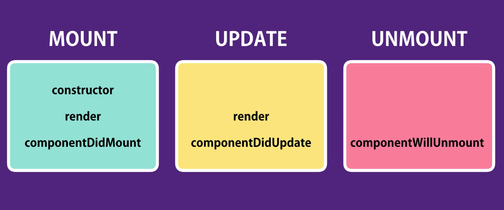
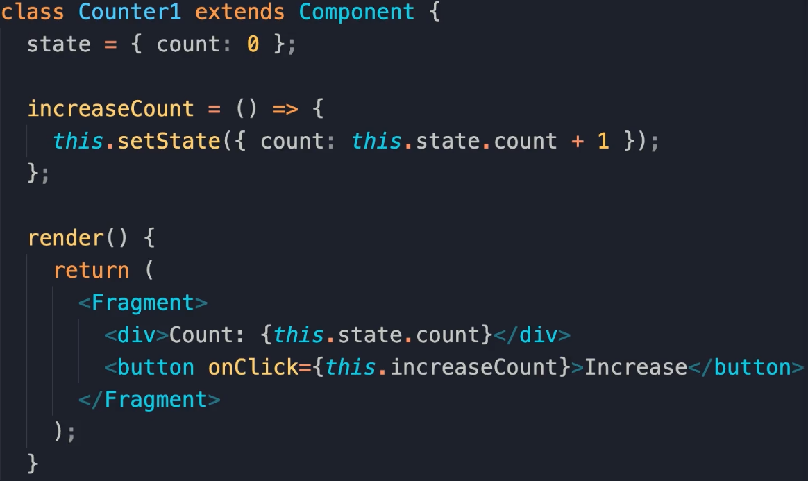
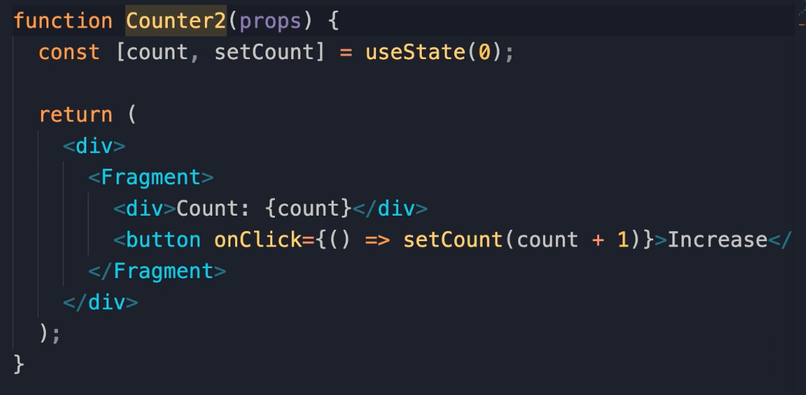
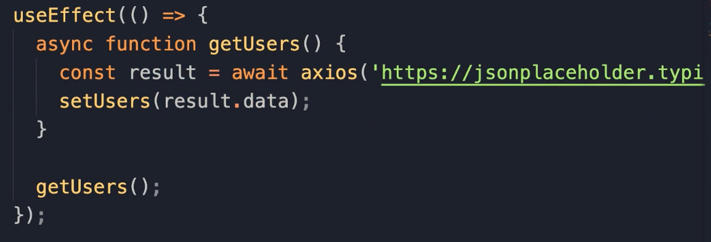
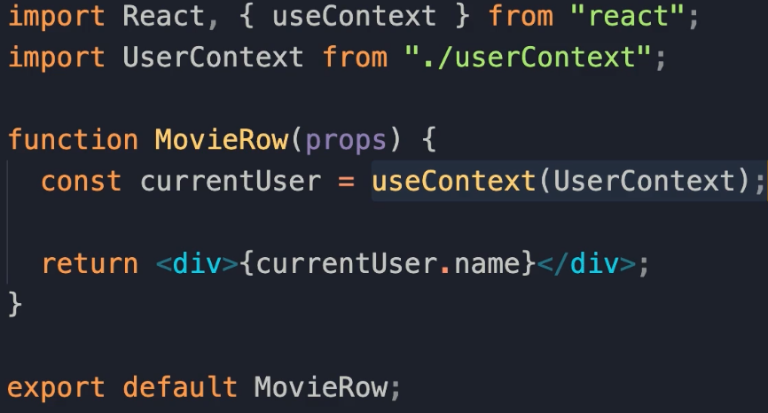

# React

- [React Angular](#react-angular)
- [Custom configs](#custom-configs)
- [React backend](#react-backend)
- [React related JS](#react-related-js)
  - [Binding this and arrow function](#binding-this-and-arrow-function)
  - [Array map Method](#array-map-method)
  - [Obj destructuring](#obj-destructuring)
  - [2 kinds of exports: Named Exports and Default Exports](#2-kinds-of-exports-named-exports-and-default-exports)
- [Specify children](#specify-children)
- [Bind event handles](#bind-event-handles)
- [Update State](#update-state)
- [Passing Event Arguments](#passing-event-arguments)
- [JSX return](#jsx-return)

---

## React Angular

The reason react is called react because it reacts to the state.

Angular is a framework. React is a library only used for view. Users can choose the routing or different framework to use for React.

[Back to top](#react)

---

## Custom configs

npm eject 会把所有 dependency 暴露出来 注意这个是 one way 的 一旦 eject 不能回来 DO NOT DO THIS

[Back to top](#react)

---

## React backend

C#/.NET
**Node.js Express**
Firebase 成型的后端服务 google 注册账号就能直接使用

[Back to top](#react)

---

## React related JS

Recap of some highly used JS in React

### var let const

Always use `let` over `var` 

- `var` -> function 一个function内部都可见 例如i在for loop之外还可见
- `let` -> code block 作用域
- `const` -> code block 作用域

[Back to top](#react)

---

### Access Objects

- `obj.name = 'a'`
- `obj['name'] = 'a'` 

[Back to top](#react)

---

### Binding this and arrow function

```js
const person = {
  name: "Yinhao",
  walk() {
    console.log(this);
  },
};

// 用obj call method
person.walk();
// output 'walk'

// 用bind()来确保person obj里的this能找到对应的obj
const walk = person.walk.bind(person);
walk();
// output 'walk'
```

- 对于独立的函数调用 **用到 callback 函数 都要记住 always use arrow function!!!!!!!!**
- Arrow functions don't rebind this keyword.

```js
// 箭头函数
const square = number => number * number;

const person = {
  name: "Yinhao",
  setTimeout(() => {
      console.log("this", this);
  }, 1000);
};

person.talk()
```

[Back to top](#react)

---

### Array map Method

- template literal

- **back tick character**

- \${color}

```js
const colors = ["red", "green", "blue"];
const items = color.map((color) => {
  `<li>${color}</li>`;
});
```

[Back to top](#react)

---

### Obj destructuring

const { street, city, country } = address;
把 obj address 中的 street 取出来放进一个叫 street 的 const 里面
const { street: st } = address;
把 obj address 中的 street property 取出来放进一个叫 st 的 const 里面

[Back to top](#react)

---

### Spread Operator

既可以用来clone/连接两个数组 也可用来clone/连接两个Obj

```js
const first = [1, 2, 3];
const second = [4, 5, 6];

// const combined = first.concat(second);
const combined = [...first, 'a', ...second, 'b'];
const clone = [...first];

const first = { name : "Name" };
const second = { job : "Job" };

const combined = { ...first, ...second, location: "US" };
```

[Back to top](#react)

---

### Class Inheritance

```js
class Person {
  constructor(name) {
    this.name = name;
  }
  
  walk() {
    console.log("walk");
  }
}

const person = new Person("Name");

class Teacher extends Person {
  constructor(name, degree) {
    super(name);
    this.degree = degree;
  }
  
  teach() {
    console.log("teach");
  }
}

const teacher = new Teacher("Teacher", "MSC");
```

[Back to top](#react)

---

### 2 kinds of exports: Named Exports and Default Exports

```js
import { Person } from './person';

export class Teacher extends Person {
  constructor(name, degree) {
    super(name);
    this.degree = degree;
  }
  
  teach() {
    console.log("teach");
  }
}
```

- Default -> import ... from ''; / export default ... 
- Named -> import { ... } from ''; / export ...

e.g. import React, { Component } from 'react';

[Back to top](#react)

---

## state

- The data that the Component needs to use
- It won't update itself - but there is a simpler way to update in React hooks

```jsx
import React, { Component } from "react";

class Counter extends Component {
  state = {
    value: this.props.value,
    tags: ["tag1", "tag2", "tag3"],
  };

  render() {
    return (
      <div>

      </div>
    );
  }

export default Counter;

```

[Back to top](#react)

---

## Setting Attributes Embedded Expressions

- 使用{}在里面写js code 实现动态操作className sytle等等
- ``

[Back to top](#react)

---

## Rendering List Dynamically Conditionally

- To use **map** function, we need to give each element a unique key so React can quickly find which DOM needs to be changed and sync with the virtual DOM.

```jsx
import React, { Component } from "react";

class Counter extends Component {
  state = {
    value: this.props.value,
    tags: ["tag1", "tag2", "tag3"],
  };

  render() {
    return (
      <div>
        <ul>
          {this.state.tags.map((tag) => (
            <li key={tag}>{tag}</li>
          ))}
        </ul>
      </div>
    );
  }

export default Counter;
```

- Use **curly braces "{}"**, and enter JS obj in it;

```jsx
return (
  <div>
    <ul>
      {this.state.tags.map((tag) => (
        <li key={tag}>{tag}</li>
      ))}
    </ul>
  </div>
);
```

- conditional rendering
  - Use helper function
  - Use **"&&"** operator

```jsx
// Method 1
// Add a helper function

renderHelp() {
  if (this.state.tags.length === 0) {
    return <p>tags number is 0</p>
  }
  return ... //
}

render() {
    return (
      <div>
        <ul>
          {this.state.tags.map((tag) => (
            <li key={tag}>{tag}</li>
          ))}
        </ul>
      </div>
    );
  }

// Method 2

render() {
    return (
      <div>
        <ul>
          {this.state.tags.length === 0 && "The tags number is 0"}
        </ul>
      </div>
    );
  }
```

[Back to top](#react)

---

## Specify children

如果同时在 return 里有不止一种 tag 需要返回 需要用到 react.Fragment 实现每一个 tag 都有一个父亲

```js
class Counter extends Component {
  render() {
    return (
      <React.Fragment>
        <h1>Hello World</h1>
        <button>Increment</button>
      </React.Fragment>
    );
  }
}
```

[Back to top](#react)

---

## Bind event handles

两种方法 bind event handler 用来解决 this 无法找到 obj 的问题
Always 使用 arrow function

```js
constructor() {
  super();
  this.handleIncrement = this.handleIncrement.bind(this);
}
```

```js
handleIncrement = () => {
  console.log("Increment Clicked", this);
};
```

[Back to top](#react)

---

## Update State

- React 不能自动 update 的 change Angular 可以 因为 input 等等的变化都是 monkey patch 的 Angular 可以实时监测任何变化
- React 里面我们要使用 setState() 来修改 state 这个过程 react 会自动同步 DOM 和 virtual DOM 保持 view 的一致
- when `setState()` is called, then React will schedule a call to **`render()`** - this is an **asynchronous call**

```jsx
state = {
  count: 0,
};

handleIncrement = (product) => {
  console.log(product);
  this.setState({ count: this.state.value + 1 });
};

render() {
  return (
    ...
  );
}
```

[Back to top](#react)

---

## Passing Event Arguments

- 传入无参箭头函数实现

- In `render()` method, `onclick` should accept **method reference**
- **right way to do this: `onClick={() => { this.handleIncrement(product)}`**

```js
handleIncrement = (product) => {
  console.log(product);
  this.setState({ count: this.state.count + 1 });
};

<button
  onClick={() => {
    this.handleIncrement(product);
  }}
  className="btn btn-secondary btn-sm"
>
  Increment
</button>;
```

[Back to top](#react)

---

## JSX return

JSX 的 return 里应该只能 return 一个 element 如果想 return 两个以上 element 他们就要有一个 parent

```js
return (
  <React.Fragment>
    <p>Showing {movieCount} movies in the database</p>
    <table className="table">
      <thead>
        <tr>...</tr>
      </thead>
      <tbody>...</tbody>
    </table>
  </React.Fragment>
);
```

[Back to top](#react)

---

# Composing Components

- Combine multiple components together to be one component
- Counters 里面可以 render 很多个不同的 counter 每个 counter 都有自己的 state

```jsx
import React, { Component } from "react";
import Counter from "./counter";

class Counters extends Component {
  state = {};

  render() {
    return (
      <div>
        <Counter />
        <Counter />
        <Counter />
        <Counter />
      </div>
    );
  }
}

export default Counters;
```

[Back to top](#react)

---

## Passing data to components

- 在 counters 里面给每一个 counter 初始化

Counters.jsx

```jsx
import React, { Component } from "react";
import Counter from "./counter";

class Counters extends Component {
  state = {
    counters: [
      { id: 1, value: 4 },
      { id: 2, value: 0 },
      { id: 3, value: 0 },
      { id: 4, value: 0 },
    ],
  };

  render() {
    return (
      <div>
        {this.state.counters.map((counter) => (
          <Counter key={counter.id} value={counter.value} />
        ))}
      </div>
    );
  }
}

export default Counters;
```

Counter.jsx

```jsx
import React, { Component } from "react";

class Counter extends Component {
  state = {
    value: this.props.value
};
```

[Back to top](#react)

---

## Passing Children

- **When we want to return something between an opening and closing tags in an element**
- 如果想要 render anything in close tags; 可以使用 children
- `this.props.children`

Counters.jsx

```jsx
import React, { Component } from "react";
import Counter from "./counter";

class Counters extends Component {
  state = {
  };

  render() {
    return (
      <div>
        {this.state.counters.map((counter) => (
          <Counter key={counter.id} value={counter.value} />
          <h4>Counter #{counter.id}</h4h4>
          </Counter>
        ))}
      </div>
    );
  }
}

export default Counters;
```

Counter.jsx

```jsx
render() {
    return (
      <div>
        {this.props.children}
      </div>
    );
  }
```

[Back to top](#react)

---

## Props vs State

- Props :

  - Data that is given to a component;

  - **Read-only** cannot change props

  - Cannot change the prop of a component within this component

  - 是父亲传给儿子的 Counters 是父亲 在 render 时 给儿子 Counter 传入了 value = {counter.value}

  - ```jsx
    {this.state.counters.map((counter) => (
              <Counter key={counter.id} value={counter.value} />
              <h4>Counter #{counter.id}</h4h4>
              </Counter>
            ))}
    ```

  - **key** 只能 react 内部用来unique id an element 所以不算是 props 的一部分

- State:

  - Data that is local or private to that component;
  - other components cannot access that state
  - Can change the state of a component within this component

[Back to top](#react)

---

## Raise and Handle events

### The component that owns a piece of the state, should be the one modifying it

- React 中如果想要修改一个 component 的 state 必须要在这个 component 里面去进行修改或删除
- 因此当我们想在另外一个组件中修改这个组件的 state 时，需要用到 raise and handle events
- 在想要修改的 component 中 raise event - example: onDelete
- 在真正完成修改的 component 中 handle event - example : handleDelete()

raise - onDelete - 孩子 rasie

```jsx
render() {
    return (
      <div>

        <button onClick={this.props.onDelete}> </button>

      </div>
    );
  }
```

handle - handleDelete() - 父亲 handle

```jsx
  handleDelete = () => {
    console.log("Event Handler Called");
  };

  render() {
    return (
      <div>
        {this.state.counters.map((counter) => (
          <Counter
            key={counter.id}
            onDelete={this.handleDelete}
            counter={counter}
          />
        ))}
      </div>
    );
  }
}
```

- 尽可能的把相关的东西放在一个 Obj 中使用 - 在 props 中 尽可能的封装
- 直接把 counter 作为 props 传给儿子

[Back to top](#react)

---

## Remove local State aka controlled components

- Between different components, it is better to let one component control the other one;
- It means the controlled component does not have state
- It acquires all data from the component that is controlling it
- 当想要在这个被控制的组件中 update state 时 - raise an event
- 父亲组件会 handle event

儿子 counter.jsx

```jsx
import React, { Component } from "react";

class Counter extends Component {
  render() {
    return (
      <div>
        
        <span style={this.styles} className={this.getBadgeClasses()}>
          {this.formatCount()}
        </span>
        <button
          onClick={() => this.props.onIncrement(this.props.counter)}
          className="btn btn-secondary btn-sm"
        >
          Increment
        </button>
        <button onClick={this.props.onDelete}> </button>
        <ul>
          {this.state.tags.map((tag) => (
            <li key={tag}>{tag}</li>
          ))}
        </ul>
      </div>
    );
  }

  getBadgeClasses() {
    let classes = "badge m-2 badge-";
    classes += this.props.counter.value === 0 ? "warning" : "primary";
    return classes;
  }

  formatCount() {
    const { value } = this.props.counter;
    return value === 0 ? "Zero" : value;
  }
}

export default Counter;
```

父亲 counters.jsx

```jsx
import React, { Component } from "react";
import Counter from "./counter";

class Counters extends Component {
  state = {
    counters: [
      { id: 1, value: 4 },
      { id: 2, value: 0 },
      { id: 3, value: 0 },
      { id: 4, value: 0 },
    ],
  };

  handleDelete = (counterId) => {
    const counters = this.state.counters.filter((c) => c.id !== counterId);
    this.setState({ counter });
  };

  handleIncrement = (counter) => {
    const counters = [...this.state.counters];
    const index = counters.indexOf(counter);
    counters[index] = { ...counter };
    counters[index].value++;
    this.setState({ counters });
  };

  render() {
    return (
      <div>
        {this.state.counters.map((counter) => (
          <Counter
            key={counter.id}
            onDelete={this.handleDelete}
            onIncrement={this.handleIncrement}
            counter={counter}
          />
        ))}
      </div>
    );
  }
}

export default Counters;
```

[Back to top](#react)

---

## Multiple Components in Sync

- 当两个 components 没有父子关系的时候 两个组件之间没有办法直接通过 props 传 data
- 因此我们需要进行 lift state up 这个操作 让这两个没有父子关系的组件 有一个共同的父亲
  - 第一步先选好两个组件的共同父亲 例如 App.jsx
  - 第二步将 Counters 中的 state 和 handle state 相关的 methods 全都放到 App.jsx 中
  - 第三部 在 App.jsx 中以 props 的形式 把 data 传给 Counters (注意命名要变成 onDelete， on 什么什么什么)
  - Counters 中对于他自己的孩子 同样以 props 的形式传数据
  - 这样就形成了一个树的结构
- 通过树的结构实现了多个组件之间的数据状态同步 （其实就是一个父亲管理 state 剩下的所有孩子都是一级一级被控制）

[Back to top](#react)

---

## Stateless Functional Components

- I prefer use Component all the time - at your choice
- 当一个 component 没有 state 没有 function 的时候 称为一个没有状态的功能组件
- Instead of using Component; we can define a function instead

Class component



stateless Functional Components



[Back to top](#react)

---

## Destructuring Arguments

- Makes code cleaner
- If you do not like to use too many `props.totalCount`, `props.counter`
- 可以提取出来对应的参数

```jsx
// Before
const NavBar = (props) => {
  return({props.totalCounters});
};

// After
const NavBar = ({totalCounters}) => {
  return({totalCounters});
};
```

[Back to top](#react)

---

## Lifecycle Hooks



- Mount
  - `constructor` - remeber to call super
  - `render` - render react element
  - `componentDidMount` - make Ajax call or retrieve data from servers
- Update
  - `render` - any update will call render to render the whole components tree
  - `componentDidUpdate(prevProps, prevState)` - 可以访问之前的props和state 判断一下如果不同 可以发送新的Ajax请求到后端要数据
- Unmount
  - `componentWillUnmount()` - when delete a component; entire tree will be re-rendered. 

[Back to top](#react)

---

## React Hooks

A.K.A **functional component** - **also stateful** 

- 出现hook的概念因为 class 很麻烦不适合新的开发者
- deal with this keyword can be hard
- boilerplate code needed to create a class

Example:

- Class implementation:



- hooks implementation:



[Back to top](#react)

---

## useState

- useState 会返回一个array
- array[0] 是 this.state.count
- array[1] 是 this.setState()

`const [count, setCount] = useState(0);`

- **cannot call hooks inside loops, condition or nested functions** 

## useEffect

- Implement all the logic in `useEffect()`

```jsx
useEffect(() => {
  document.title = `${name} has clicked ${count} times!`;
  
  return () => { // equal to componentWillUnmount
    
  }
}, [count, name]);
// count and name means useEffect会自动更新count 和 name
```

- fetching data with hooks

useEffect 里面不能直接写 async

因此要在callback里面再定义一个async；并且要手动调用一次这个function 因为他不会自动被调用



## custom hooks

```jsx
import { useEffect } from 'react';

export default function useDocumentTitle(title) {
  useEffect(() => {
    document.title = title;
    
    return () => {
      console.log("clean up")
    };
  });
}
```

## Context



