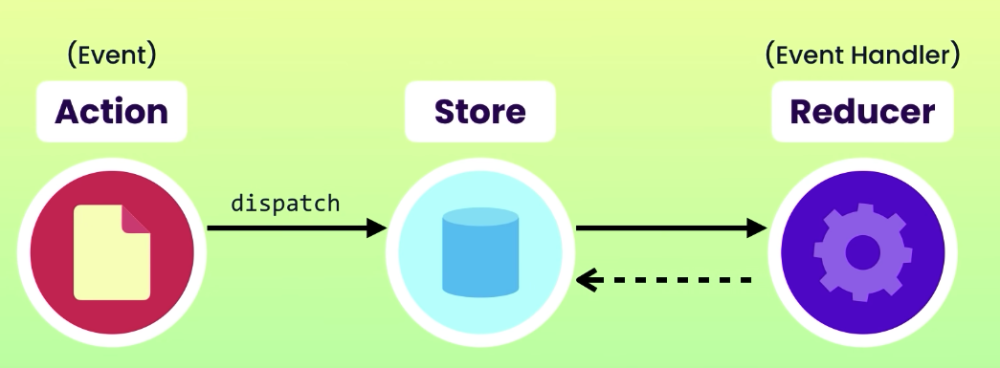

# Redux

> Centralizes application state
>
> Makes data flow transparent and predictable

A state management library for JavaScript apps.

We may need to keep many UIs in sync, data can flow from one ui to another one.

FaceBook founded Flux architect partten, then created Redux.

Pros/Cons

- Log Rocket: Time-travel debugging: We can jump/skip to any action to see the associated states
- Cache or preserve states
- But it is complicated.

## Functional Programming

> programming paradigms: 
>
> - Functional
> - Onject-oriented
> - Procedural
> - Event-driven

- Functional programming is deposing a big problems to many small reusable functions, and the functions take input and give output, but they do not mutate or change the data, which makes the code more concise/scalable, easier to debug/test. We can run many functions in parallel to take the advantages of muliple cores of CPUs.

- Lanages: Clojure, Haskell, JavaScript

### Functions are first class citizens in JS

We can pass a function as parameters, return function as result, assign a function to a varible, pass a function's reference into another function.

### Higher order functions

The functions that take a function reference as argument or the functions that return a function as result are called higher order functions, because they operates over other functions.

e.g.

```js
let number = [1, 2, 3];
numbers.map(number => number * 2);

setTimeout(() => console.log("smt"))
```

### An example of Function Programming with lodash

```js
import { compose, pipe } from 'lodash/fp';

let input = "   JavaScript   ";
let output = "<div>" + input.trim() + "</div>";

// Functional programming way:
const trim = str => str.trim();
const wrapInDiv = str => `<div>${str}</div>`;
const toLowerCase = str => str.toLowerCase();

const result = wrapInDiv(toLowerCase(trim(input)));

// With lodash no need to add that many ((()))
const transform = compose(wrapInDiv, toLowerCase, trim);
transform(input);
// with pipe we no longer need to read code from right to left
const transform = pipe(wrapInDiv, toLowerCase, trim);
transform(input);
```

### Currying

Convert a function that takes N parameters into 1, separates parameters using `()` instead of `,`

```js
function add(a) {
    return function(b) {
        return a + b;
    };
}

const add1 = add(1);
add1(5); // return 6

// A good way to use Currying
const add2 = a => b => a + b;
// With currying
add(1)(5); //add(1, 5)
// N => 1
```

### Pure functions

- No random values
- No current date/time
- No global state (DOM, files, db, etc)
- No mutation of parameters
- **In redux, `reducers` must be pure**

Benefits:

- Self-documenting
- Easily testable
- Concurrency
- Cacheable

#### Immutability of pure functions

**In redux, DO NOT MUTATE DATA, That is a rule.**

Once created, not to be changed!

const string is immutable, but const obj is not immutable

const object only prevents reassignment not change

### Update a Obj

**Spread operator only does shallow copy**, so be careful about nested objs, example below

```js
const person = {
  name: "John",
  address: {
    country: "USA",
    cityL "LA"
  }
}

Spread operator does a shallow copy
const updated = {...person, name: "Bob"};
updated.address.city = "NYC" // This will also update the original one

Do this:

const updated = {
  ...person,
  address: {
    ...person.address,
    city: "NYC"
  },
  name: "Bob"
}

```

### Update an Array

```js
const numbers = [1, 2, 3];

//Adding
const index = numbers.indexOf(2);
const addded = [...number.slice(0, index), 4, ...number.slice(index)];

// Removing
const removed = numbers.filter(n => n != 2);

// Updating
const updated = numbers.map(n => n === 2 ? 20 : n);
```

### ImmutableJS vs immer 

- Immutable use `Map`, but we no longer access Obj using `.` , we need to use `get` and ` set`
- **immer** use `Produce` , similar to how we access obj - This is the choice here



## Store - single source of truth

Store all application states in a certal store - A single JavaScript Object - Single source of truth, it is accessible in all parts of our app

- We do not directly mutable the Store - it has to be done by calling reducer function

```js
import { createStore } from 'redux';
import reducer from './reducer';

const store = createStore(reducer);

export default store;
```

## Reducer - like Event handler

- Usually one or more reducers to handle different slices of store
- Take a current store and return an updated store.
- Take store as first parameter, action as second parameter.

```js
import * as actions from './actionTypes';

let lastId = 0;

export default function reducer(state = [], action) {
    switch (action.type) {
        case actions.BUG_ADDED:
            return [
                ...state,
                {
                    id: ++ lastId,
                    description: action.payload.description,
                    resolved: false,
                }
            ]
            
        case actions.BUG_REMOVED:
            return state.filter(bug => bug.id !== action.payload.id);

        case actions.BUG_RESOLVED:
            return state.map(bug => 
                bug.id !== action.payload.id ? bug : {...bug, resolved: true}
            )

        default:
            return state;
    }
}
```

## Action - like event

- Plain JS objects that represent what just happened

Example of a action

**Redux requires a `type`**

```js
{
  type: "ADD_BUG",
  payload: {
    description: "..."
  } 
}
```

## How to use Redux

Follow the steps

- Design the store 
- Define the actions
- Create a reducer
- Set up the store

```js
import store from './store';

store.dispatch({
    type: "bugAdded",
    payload: {
        description: "Bug1",
    }
})

store.dispatch({
    type: "bugRemoved",
    payload: {
        id : 1,
    }
})
console.log(store.getState());
```

## Subscribe a store

Pass a function as an argument, this function gets called every time the state of store gets changed

React should do rerender here, UI should subscribe to the store, so it gets notified when stores changed

- **This sbuscribe function return an function for unsubscribes the store** so it prevents the memory leak
- This is very important since user can navigate away from this page, this would prevent memory leak

```js
import store from './store';

const unsubscribe = store.subscribe(() => {
    console.log("Store changed", store.getState())
})

store.dispatch({
    type: "bugAdded",
    payload: {
        description: "Bug1",
    }
})

unsubscribe();

store.dispatch({
    type: "bugRemoved",
    payload: {
        id : 1,
    }
})
console.log(store.getState());
```

## Action types

We will want to define all action types in a separate file, so we do not have to change it in all code files everytime we want to make a change

```js
export const BUG_ADDED = "bugAdded";
export const BUG_REMOVED = "bugRemoved";
```

## Action creator

We do not want to write the same action every time we need to create one. So we want to define action creator, then we can use it everywhere

```js
import * as actions from './actionTypes';

export const bugAdded = description => ({
    type: actions.BUG_ADDED,
    payload: {
        description: description, // or just description,
    }
});

export default function bugAdded(description) {
    return {
        type: actions.BUG_ADDED,
        payload: {
            description: description,
        }
    }
}
```

# Webpack

A JS bundler, we tell app the entry point is for example index.js, then webpack will bundle all js files into for example app.js, and put it in for example  __dist folder

