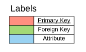
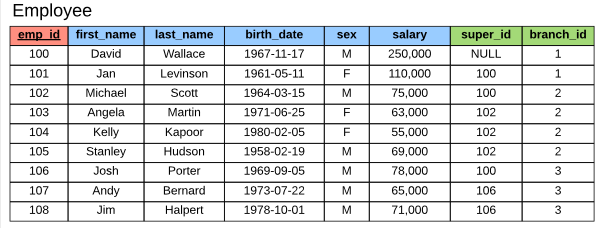
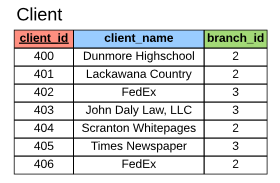
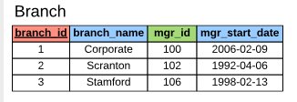
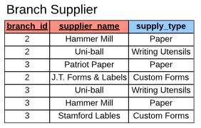
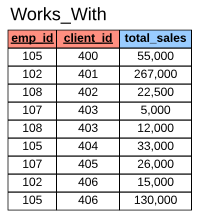
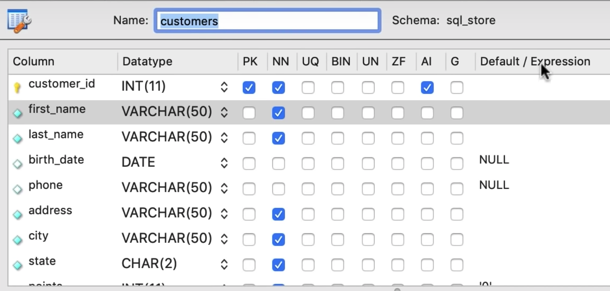

## SQL

**NOT CASE SENSITIVE**

* [DBMS](#dbms)
* [Primary Key & Foreign Key & Composite Key](#primary-key---foreign-key---composite-key)
* [CREATE DATABASE](#create-database)
* [CREATE TABLE](#create-table)
* [INSERT INTO dbName(colName1, colName2) VALUES(value1, value2, 'value3')](#insert-into-dbname-colname1--colname2--values-value1--value2---value3--)
* [Add Constrains when CREATE TABLE](#add-constrains-when-create-table)
* [UPDATE & DELETE FROM](#update-&-delete-from)
* [CREATE a Complex Database](#create-a-complex-database)
* [SELECT](#select)
* [WHERE](#where)
* [Combined search AND OR NOT](#combined-search-and-or-not)
* [IN](#in)
* [BETWEEN](#between)
* [LIKE](#like)
* [REGEXP](#regexp)
* [IS NULL](#is-null)
* [ORDER BY Clause](#order-by-clause)
* [LIMIT Clause](#limit-clause)
* [JOIN (INNER JOIN) INNER 可以省略](#join-inner-join-inner-可以省略)
* [Combine columns from tables across Databases](#combine-columns-from-tables-across-databases)
* [SELF JOIN](#self-join)
* [Join Multiple Tables](#join-multiple-tables)
* [Composite primary key JOIN table](#composite-primary-key-join-table)
* [Implicit join syntax](#implicit-join-syntax)
* [LEFT JOIN RIGHT JOIN (OUTER JOIN) OUTER 可以省略](#left-join-right-join-outer-join-outer-可以省略)
* [Outer join in multiple tables](#outer-join-in-multiple-tables)
* [Self OUTTER JOIN](#self-outter-join)
* [USING Clause](#using-clause)
* [NATURAL JOIN](#natural-join)
* [CROSS JOIN](#cross-join)
* [UNION](#union)
* [Column attributes](#column-attributes)
* [INSERT INTO a single row](#insert-into-a-single-row)
* [INSERT INTO multiple rows](#insert-into-multiple-rows)
* [INSERT Hieraichical Rows (INSERT INTO 多个 tables)](#insert-hieraichical-rows-insert-into-多个-tables)
* [Copy data from one table to another](#copy-data-from-one-table-to-another)
* [Update a single row](#update-a-single-row)
* [Update Multiple rows](#update-multiple-rows)
* [Using Subqueries in Updates](#using-subqueries-in-updates)
* [Delete Row](#delete-row)

### DBMS

- relational db
- NoSQL non relational db

[Back to top](#sql)

---

### Primary Key & Foreign Key & Composite Key

- Primary key 是唯一的 用来对应一个表中唯一的元素 不可以为空
- Foreign key 一个表里可以有多个 是用来和别的表建立关系的 一般情况的 foreign key 是别的表的 primary key
- Composite key 是多个列（例如两个外键）结合起来共同形成一个 主键 也就是 两个主键共同确定一个 record

[Back to top](#sql)

---

### CREATE DATABASE

```sql
CREATE DATABASE name
```

[Back to top](#sql)

---

### CREATE TABLE

- INT                           *-- Whole Numbers* 
- DECIMAL(M,N)                  *-- Decimal Numbers - Exact Value* 
- VARCHAR(l)                    *-- String of text of length l* 
- BLOB                          *-- Binary Large Object, Stores large data* (例如用来存储图片 文件)
- DATE                          *-- 'YYYY-MM-DD'* 
- TIMESTAMP                     *-- 'YYYY-MM-DD HH:MM:SS' - used for recording events*

```sql
-- Creating tables
CREATE TABLE student (
  student_id INT PRIMARY KEY,
  name VARCHAR(40),
  major VARCHAR(40)
  -- PRIMARY KEY(student_id)
);

DESCRIBE student;
DROP TABLE student;
ALTER TABLE student ADD gpa DECIMAL;
ALTER TABLE student DROP COLUMN gpa;
```

[Back to top](#sql)

---

### INSERT INTO dbName(colName1, colName2) VALUES(value1, value2, 'value3') 

- 由于主键不能重复 所以不能重复输入相同的记录

```sql
INSERT INTO student VALUES(1, 'Jack', 'Biology');
INSERT INTO student VALUES(2, 'Kate', 'Sociology');
INSERT INTO student(student_id, name) VALUES(3, 'Claire');
INSERT INTO student VALUES(4, 'Jack', 'Biology');
INSERT INTO student VALUES(5, 'Mike', 'Computer Science');
```

[Back to top](#sql)

---

### Add Constrains when CREATE TABLE

- NOT NULL - 不能为空
- UNIQUE - 不能重复
- DEFAULT - 设置为默认值 
- AUTO_INCREMENT - 设置为自增

```sql
CREATE TABLE student (
 	student_id INT PRIMARY KEY AUTO_INCREMENT,
  name VARCHAR(40) NOT NULL,
  -- name VARCHAR(40) UNIQUE,
  major VARCHAR(40) DEFAULT 'undecided',
);
```

[Back to top](#sql)

---

### UPDATE & DELETE FROM

```sql
-- Delete every record
DELETE FROM student;

-- 加条件delete
DELETE FROM student
WHERE student_id = 4;

-- 同一句里面可以写多个 statement
DELETE FROM student
WHERE major = 'Sociology' AND name = 'Kate';

-- 更新所有
UPDATE student
SET major = 'Undecided';

-- 有条件更新
UPDATE student
SET name = 'Johnny'
WHERE student_id = 4;

UPDATE student
SET major = 'Biological Sciences'
WHERE major = 'Biology';

UPDATE student
SET major = 'Biosociology'
WHERE major = 'Biology' OR major = 'sociology'

UPDATE student
SET major = 'Undecided', name = 'Tom'
WHERE student_id = 4;
```

[Back to top](#sql)

---

### CREATE a Complex Database

[pdf schema](./schema/company-database.pdf)













```sql
 CREATE TABLE employee (
  emp_id INT PRIMARY KEY,
  first_name VARCHAR(40),
  last_name VARCHAR(40),
  birth_day DATE,
  sex VARCHAR(1),
  salary INT,
  super_id INT,
  branch_id INT
);

CREATE TABLE branch (
  branch_id INT PRIMARY KEY,
  branch_name VARCHAR(40),
  mgr_id INT,
  mgr_start_date DATE,
  FOREIGN KEY(mgr_id) REFERENCES employee(emp_id) ON DELETE SET NULL
);

ALTER TABLE employee
ADD FOREIGN KEY(branch_id)
REFERENCES branch(branch_id)
ON DELETE SET NULL;

ALTER TABLE employee
ADD FOREIGN KEY(super_id)
REFERENCES employee(emp_id)
ON DELETE SET NULL;

CREATE TABLE client (
  client_id INT PRIMARY KEY,
  client_name VARCHAR(40),
  branch_id INT,
  FOREIGN KEY(branch_id) REFERENCES branch(branch_id) ON DELETE SET NULL
);

CREATE TABLE works_with (
  emp_id INT,
  client_id INT,
  total_sales INT,
  PRIMARY KEY(emp_id, client_id),
  FOREIGN KEY(emp_id) REFERENCES employee(emp_id) ON DELETE CASCADE,
  FOREIGN KEY(client_id) REFERENCES client(client_id) ON DELETE CASCADE
);

CREATE TABLE branch_supplier (
  branch_id INT,
  supplier_name VARCHAR(40),
  supply_type VARCHAR(40),
  PRIMARY KEY(branch_id, supplier_name),
  FOREIGN KEY(branch_id) REFERENCES branch(branch_id) ON DELETE CASCADE
);


-- -----------------------------------------------------------------------------

-- Corporate
INSERT INTO employee VALUES(100, 'David', 'Wallace', '1967-11-17', 'M', 250000, NULL, NULL);

INSERT INTO branch VALUES(1, 'Corporate', 100, '2006-02-09');

UPDATE employee
SET branch_id = 1
WHERE emp_id = 100;

INSERT INTO employee VALUES(101, 'Jan', 'Levinson', '1961-05-11', 'F', 110000, 100, 1);

-- Scranton
INSERT INTO employee VALUES(102, 'Michael', 'Scott', '1964-03-15', 'M', 75000, 100, NULL);

INSERT INTO branch VALUES(2, 'Scranton', 102, '1992-04-06');

UPDATE employee
SET branch_id = 2
WHERE emp_id = 102;

INSERT INTO employee VALUES(103, 'Angela', 'Martin', '1971-06-25', 'F', 63000, 102, 2);
INSERT INTO employee VALUES(104, 'Kelly', 'Kapoor', '1980-02-05', 'F', 55000, 102, 2);
INSERT INTO employee VALUES(105, 'Stanley', 'Hudson', '1958-02-19', 'M', 69000, 102, 2);

-- Stamford
INSERT INTO employee VALUES(106, 'Josh', 'Porter', '1969-09-05', 'M', 78000, 100, NULL);

INSERT INTO branch VALUES(3, 'Stamford', 106, '1998-02-13');

UPDATE employee
SET branch_id = 3
WHERE emp_id = 106;

INSERT INTO employee VALUES(107, 'Andy', 'Bernard', '1973-07-22', 'M', 65000, 106, 3);
INSERT INTO employee VALUES(108, 'Jim', 'Halpert', '1978-10-01', 'M', 71000, 106, 3);


-- BRANCH SUPPLIER
INSERT INTO branch_supplier VALUES(2, 'Hammer Mill', 'Paper');
INSERT INTO branch_supplier VALUES(2, 'Uni-ball', 'Writing Utensils');
INSERT INTO branch_supplier VALUES(3, 'Patriot Paper', 'Paper');
INSERT INTO branch_supplier VALUES(2, 'J.T. Forms & Labels', 'Custom Forms');
INSERT INTO branch_supplier VALUES(3, 'Uni-ball', 'Writing Utensils');
INSERT INTO branch_supplier VALUES(3, 'Hammer Mill', 'Paper');
INSERT INTO branch_supplier VALUES(3, 'Stamford Lables', 'Custom Forms');

-- CLIENT
INSERT INTO client VALUES(400, 'Dunmore Highschool', 2);
INSERT INTO client VALUES(401, 'Lackawana Country', 2);
INSERT INTO client VALUES(402, 'FedEx', 3);
INSERT INTO client VALUES(403, 'John Daly Law, LLC', 3);
INSERT INTO client VALUES(404, 'Scranton Whitepages', 2);
INSERT INTO client VALUES(405, 'Times Newspaper', 3);
INSERT INTO client VALUES(406, 'FedEx', 2);

-- WORKS_WITH
INSERT INTO works_with VALUES(105, 400, 55000);
INSERT INTO works_with VALUES(102, 401, 267000);
INSERT INTO works_with VALUES(108, 402, 22500);
INSERT INTO works_with VALUES(107, 403, 5000);
INSERT INTO works_with VALUES(108, 403, 12000);
INSERT INTO works_with VALUES(105, 404, 33000);
INSERT INTO works_with VALUES(107, 405, 26000);
INSERT INTO works_with VALUES(102, 406, 15000);
INSERT INTO works_with VALUES(105, 406, 130000);
```

[Back to top](#sql)

---

### SELECT

- 可以使用加减乘除

```sql
USE sql_store;

SELECT * FROM customers

SELECT
		last_name,
    first_name,
    points,
    (points + 10) * 100 AS 'discount factor'
From customers
```

- 获得唯一的数据 DISTINCT

```sql
SELECT DISTINCT state
FROM customers
```

[Back to top](#sql)

---

### WHERE

- 用于选择条件

```sql
SELECT *
FROM customers
WHERE points > 3000

SELECT *
FROM customers
WHERE state = 'VA'

SELECT *
FROM customers
WHERE state != 'VA'

SELECT *
FROM customers
WHERE birth_date > '1990-01-01'
```

[Back to top](#sql)

---

### Combined search AND OR NOT

- AND 优先级高于 OR
- 跟算数运算符一样 可以使用括号来明确优先级

```sql
SELECT *
FROM Customers
WHERE birth_date > '1990-01-01' OR points > 1000;
```

[Back to top](#sql)

---

### IN

- 在多个数值中选择
- 可以使用 NOT IN

```sql
SELECT *
FROM Customers
WHERE state IN ('VA', 'FL', 'GA')

SELECT *
FROM Customers
WHERE state NOT IN ('VA', 'FL', 'GA')
```

[Back to top](#sql)

---

### BETWEEN

- 在两个数值区间选择
- BETWEEN 1 AND 10 表示大于等于 1 小于等于 10

```sql
SELECT *
FROM Customers
WHERE points BETWEEN 1000 AND 3000
```

[Back to top](#sql)

---

### LIKE

- 用于选择出一个特定 pattern 的结果
- `-- % any number of characters`
- `-- _ single character`

```sql
SELECT *
FROM Customers
WHERE last_name LIKE 'b%'
-- b之后可以有任意多字母

SELECT *
FROM Customers
WHERE last_name NOT LIKE 'b___y'
```

[Back to top](#sql)

---

### REGEXP

- `WHERE last_name REGEXP 'field|mac'` 表示名字里带有 field 或者 mac
- `WHERE last_name REGEXP '^field'` 表示名字开头是 field
- `WHERE last_name REGEXP 'field&'` 表示名字结尾是 field
- `WHERE last_name REGEXP 'e'` 表示名字里带有 e
- `WHERE last_name REGEXP '[gim]e'` 表示名字里带有 ge, ie, me
- `WHERE last_name REGEXP '[a-h]e'` 表示名字里带有 a 到 h 和 e 结合

```sql
SELECT *
FROM Customers
WHERE last_name REGEXP 'field'

-- ^ beginning
-- $ end
-- | logical or
-- [abcd]
-- [a-f]
```

[Back to top](#sql)

---

### IS NULL

- 判断空字段
- 也可以使用 NOT 选择到非 NULL item

```sql
SELECT *
FROM Customers
WHERE phone IS NULL

SELECT *
FROM Customers
WHERE phone IS NOT NULL
```

[Back to top](#sql)

---

### ORDER BY Clause

- 默认中是按照表的 id 排列 主键 并且唯一
- 可以使用 ORDER BY 来利用别的 column 排列所需要的数据
- 默认 ORDER BY 是按照 acesending order 升序排列

```sql
SELECT *
FROM Customers
ORDER BY first_name

-- 可以使用 DESC 变成倒叙排列
SELECT *
FROM Customers
ORDER BY first_name DESC

-- 可以同时使用两个 column 来进行排序
SELECT *
FROM Customers
ORDER BY state DESC, first_name DESC

-- 在 MySQL 中可以使用没有选中的 col 作为排序的 index
SELECT first_name, last_name
FROM Customers
ORDER BY state DESC
```

[Back to top](#sql)

---

### LIMIT Clause

- 限制显示的数量 前 300 个
- 可以添加一个 offset 来实现 pagenation

```sql
SELECT *
FROM Customers
LIMIT 300

-- 表示跳过前 6 条数据 然后显示 3 条数据
SELECT *
FROM Customers
LIMIT 6, 3
```

[Back to top](#sql)

---

### JOIN (INNER JOIN) INNER 可以省略

- 连接两个表 JOIN
- 在 ON 后面写上连接表所需要的条件
- 要用到表名字 dot 列名字

```sql
SELECT *
FROM orders
JOIN customers
	ON orders.customer_id = customers.customer_id

-- 当想要选择一个同时存在在两个 tables 里的一个 col 时 我们需要明确表名字，选择对应的 col

SELECT  order_id, orders.customer_id, first_name, last_name
FROM orders
JOIN customers
	ON orders.customer_id = customers.customer_id

-- 由于表的名字重复了很多次 因此我们可以选择使用alias
-- FROM orders o 使用o代替表名字 从而简化code

SELECT  order_id, o.customer_id, first_name, last_name
FROM orders o
JOIN customers c
	ON o.customer_id = c.customer_id
```

[Back to top](#sql)

---

### Combine columns from tables across Databases

- 只需要给非当前使用的 DB 加 table 的 prefix

```sql
USE sql_store;

SELECT  *
FROM order_items oi
JOIN sql_inventory.products p
	ON oi.product_id = p.product_id

-- 这里我们 USE 的是 sql_inventory DB 所以需要在order_item 前面加上他对应的 db 的 prefix
USE sql_inventory;

SELECT  *
FROM sql_store.order_items oi
JOIN products p
	ON oi.product_id = p.product_id
```

[Back to top](#sql)

---

### SELF JOIN

- 与两个 table join 几乎相同
- 但是需要使用两个不同的 alias
- 同时在选择每一个 col 时候 也需要加上 prefix 因为这里的每一个列都同时存在于两个表中

```sql
USE sql_hr;

SELECT
	e.employee_id,
    e.first_name,
    m.first_name AS manager
FROM employees e
JOIN employees m
	ON e.reports_to = m.employee_id
```

[Back to top](#sql)

---

### Join Multiple Tables

- 只需要连续写 join 就可以 join 多个表

```sql
USE sql_store;

SELECT
	o.order_id,
    o.order_date,
	c.first_name,
    c.last_name,
    os.name AS status
FROM orders o
JOIN customers c
	ON o.customer_id = c.customer_id
JOIN order_statuses os
	ON o.status = os.order_status_id
```

[Back to top](#sql)

---

### Composite primary key JOIN table

- 两个主键同时用 对应一个 record

```sql
-- Compound joint condition
USE sql_store;

SELECT *
FROM order_items oi
JOIN order_item_notes oin
	ON oi.order_id = oin.order_id
  AND oi.product_id = oin.product_id

```

[Back to top](#sql)

---

### Implicit join syntax

- **NEVER USE THIS**

```sql
SELECT *
FROM orders o, customers c
WHERE o.customer_id = c.customer_id
```

[Back to top](#sql)

---

### LEFT JOIN RIGHT JOIN (OUTER JOIN) OUTER 可以省略

- 不论 ON 后面的 condition 如何 如果使用了以下两种 JOIN 的方式

- LEFT JOIN: 在左边的表中的所有信息都会被 return 到结果中
- RIGHT JOIN: 在右边的表中的所有信息都会被 return 到结果中

```sql
SELECT
		c.customer_id,
    c.first_name,
    o.order_id
FROM customers c
LEFT JOIN orders o
	ON c.customer_id = o.customer_id
ORDER BY c.customer_id
```

[Back to top](#sql)

---

### Outer join in multiple tables

- 和 inner join 多个 tables 一样使用
- 虽然可以但是不要混着使用 LEFT RIGHT JOIN
- 永远使用 LEFT JOIN

```sql
SELECT
		c.customer_id,
    c.first_name,
    o.order_id,
    sh.name AS shipper
FROM customers c
LEFT JOIN orders o
	ON c.customer_id = o.customer_id
LEFT JOIN shippers sh
	ON o.shipper_id = sh.shipper_id
ORDER BY c.customer_ID

-- join多个表 例子
SELECT
		o.order_id,
    o.order_date,
    c.first_name AS customer,
    sh.name AS shipper,
    os.name AS status
FROM orders o
JOIN customers c
	ON o.customer_id = c.customer_id
LEFT JOIN shippers sh
	ON o.shipper_id = sh.shipper_id
JOIN order_statuses os
	ON o.status = os.order_status_id
ORDER BY o.order_id
```

[Back to top](#sql)

---

### Self OUTTER JOIN

- 和 inner join 没有区别
- 在如下例子中 manager 没有 reports_to 所以导致了表中无法查询到 CEO 信息
- 我们改用 LEFT JOIN 来让表显示 CEO 信息 尽管 CEO 没有 reports_to 也可以显示出 CEO 的 record

```sql
USE sql_hr;

SELECT
		e.employee_id,
    e.first_name,
    m.first_name AS manager
FROM employees e
LEFT JOIN employees m
	ON e.reports_to = m.employee_id
```

[Back to top](#sql)

---

### USING Clause

- 在 ON 后面 condition 里面 如果两个表的对应列的名字完全一样 可以使用 USING keyword 去简化代码
- 当对应两个列名字不完全相同时不能使用

```sql
SELECT
		o.order_id,
    c.first_name,
    sh.name AS shipper
FROM orders o
JOIN customers c
		-- ON o.customer_id = c.customer_id
    USING (customer_id)
LEFT JOIN shippers sh
		USING (shipper_id)

-- JOIN 联合主键的表 使用 USING keyword
SELECT *
FROM order_items oi
JOIN order_item_notes oin
		-- ON oi.order_id = oin.order_id AND oi.product_id = oin.product_id
    -- 使用 USING keyword 简化代码
    USING (order_id, product_id)

-- E.G.
USE sql_invoicing;

SELECT
	p.date,
	c.name AS client,
	p.amount,
	pm.name AS payment_method
FROM payments p
JOIN clients c USING (client_id)
JOIN payment_methods pm
	ON p.payment_method = pm.payment_method_id
```

[Back to top](#sql)

---

### NATURAL JOIN

- NEVER USE THIS
- sql 会自动的找到对应的表中相同的列 然后 join 一起 很危险 不要用

```sql
SELECT
	o.order_id,
	c.first_name
FROM orders o
NATURAL JOIN customers c
```

[Back to top](#sql)

---

### CROSS JOIN

- 当一个商品用 小中大 红蓝白 这种属性的时候 我们想要每一种商品都产生一个选项 就可以使用 CROSS JOIN 其他时间几乎不用
- 有两种写法 例如下面的例子中 不推荐注释中的写法 不过也是对的

```sql
USE sql_store;

SELECT
		c.first_name AS customer,
    p.name AS product
-- FROM customers c, orders o
FROM customers c
CROSS JOIN products p
ORDER BY c.first_name
```

[Back to top](#sql)

---

### UNION

- combine rows 从多个表中
- 使用 UNION 不仅仅可以在一个表中 结合多个行 也可以从多个不同的表中结合多个行
- 但是要注意想要 UNION 的行必须要拥有相同数量的 col 不然就会报错
- UNION 前面的表 决定了这一列叫什么名字 如下例子 2 shipper 在前面 所以结果的表列名叫做 name 如果 customers 表在前 那么结果中表的列名就会叫 first_name

```sql
USE sql_store;

SELECT
		order_id,
    order_date,
    'Active' AS status
FROM orders
WHERE order_date >= '2019-01-01'
UNION
SELECT
		order_id,
    order_date,
    'Archived' AS status
FROM orders
WHERE order_date < '2019-01-01'

-- 例子2
SELECT name
FROM shippers
UNION
SELECT first_name
FROM customers
```

```sql
USE sql_store;

SELECT
		customer_id,
    first_name,
    points,
    'Bronze' AS type
FROM customers
WHERE points < 2000
UNION
SELECT
		customer_id,
    first_name,
    points,
    'Silver' AS type
FROM customers
WHERE points BETWEEN 2000 AND 3000
UNION
SELECT
		customer_id,
    first_name,
    points,
    'Gold' AS type
FROM customers
WHERE points > 3000
```

[Back to top](#sql)

---

### Column attributes



- Datatype
  - INT(11) 表示整数
  - VARCHAR(50) 表示 up to 50 字节
  - CHAR(50) 固定 50 字节
- PK - primary key
- NN - not null
- AI - auto increment 一般用在主键
- Default/Expression 默认值

[Back to top](#sql)

---

### INSERT INTO a single row

- 如果不明确 INSERT INTO 的 cols 就需要在 VALUES 里面添加对应的 default
- 建议永远都明确 col 然后在下面写入对应的 VALUES

```sql
USE sql_store;

INSERT INTO customers (
		first_name,
    last_name,
    birth_date,
    address,
    city,
    state
)
VALUES (
    'John',
    'Smith',
    '1990-01-01',
    'address',
    'city',
    'CA'
)
```

[Back to top](#sql)

---

### INSERT INTO multiple rows

- 只要在 VALUES 后面加逗号 括号 里面添加新的值 就可以同时 INSERT INTO 多个行了

```sql
USE sql_store;

INSERT INTO shippers (name)
VALUES ('Shipper1'),
	   	 ('Shipper2'),
       ('Shipper3')
```

[Back to top](#sql)

---

### INSERT Hieraichical Rows (INSERT INTO 多个 tables)

- 先加入 父亲 table 里面的 record
- 然后使用 LAST_INSERT_ID() 去找到刚加入的 record 的 id
- 使用这个 id 再次 INSERT INTO 对应的表 就可以实现 层级化的从上到下为多个 tables 添加 record

```sql
INSERT INTO orders (customer_id, order_date, status)
VALUES (1, '2019-01-02', 1);

INSERT INTO order_items
VALUES
		(LAST_INSERT_ID(), 1, 1, 2.95),
    (LAST_INSERT_ID(), 2, 1, 3.95)
```

[Back to top](#sql)

---

### Copy data from one table to another

- copy 过来的表会没有主键
- mysql 会直接忽略主键 自增等等属性

```sql
USE sql_store;

CREATE TABLE orders_archived AS
-- 以下的部分称为一个 sub query
SELECT *
FROM orders
WHERE order_date < '2019-01-01'

-- E.G.
USE sql_invoicing;

CREATE TABLE invoices_archived AS
SELECT
		i.invoice_id,
    i.number,
    c.name AS client,
    i.invoice_total,
    i.payment_total,
    i.invoice_date,
    i.payment_date,
    i.due_date
FROM invoices i
JOIN clients c
		USING (client_id)
WHERE payment_date IS NOT NULLinvoices_archived
```

[Back to top](#sql)

---

### Update a single row

- 可以 SET DAFAULT 值 或者 NULL
- 也可以在 SET 里面使用表达式

```sql
USE sql_invoicing;

UPDATE invoices
SET payment_total = 10, payment_date = '2019-03-01'
WHERE invoice_id = 1

-- E.G.
USE sql_invoicing;

UPDATE invoices
SET
	payment_total = invoice_total * 0.5,
	payment_date = due_date
WHERE invoice_id = 3

```

[Back to top](#sql)

---

### Update Multiple rows

- 修改 WHERE 里面的条件
- 可以使用 WHERE 中的 IN 来选择多个 records 去 update

```sql
UPDATE invoices
SET
	payment_total = invoice_total * 0.5,
	payment_date = due_date
WHERE client_id IN (3, 4)
```

[Back to top](#sql)

---

### Using Subqueries in Updates

- 可以使用 SELECT 做一个 sub query 获取 id 然后用这个 id 进行 update

```sql
UPDATE invoices
SET
	payment_total = invoice_total * 0.5,
	payment_date = due_date
WHERE client_id IN
			(SELECT client_id
			FROM clients
			WHERE state IN ('CA', 'NY'))
```

[Back to top](#sql)

---

### Delete Row

- 使用 DELETE FROM
- 同时也可以使用 subquery 在 delete 里面

```sql
DELETE FROM invoices
WHERE client_id = (
	SELECT *
	FROM clients
	WHERE name = 'Myworks'
)
```

[Back to top](#sql)

---